# HOMER for Jellyfin

A TiVo-style TV-appliance interface for Jellyfin Web: a HOMER Home screen, the
Channel Guide, Movies and TV Shows screens, and a global skin so every remaining
Jellyfin page matches. On a phone, HOMER has a phone layout (see
[On a phone](#on-a-phone)).

## Home

Home replaces Jellyfin's home page: a main menu (Live TV, Now Playing, Movies,
TV Shows, Music, Radio, Books, Sports, News, Planes and Settings, plus House
once Home Assistant is connected) and an On Now
panel, and
rows of Continue Watching, Up Next, On Now and Recently Added. The search box
sits above the menu (▲ or `/`).

- **Watch** plays the channel in the On Now preview window, and Home stays up
  so you can keep browsing. The panel shows what you're watching, with
  **Full screen**, **Guide** and **Stop**.
- **H**, or the HOMER logo at the top left of any HOMER screen, comes back to
  Home from anywhere.
### The main menu, in one of two treatments

The menu is one list (`shared/menu.js`), drawn on Home and on Now Playing, so
both screens agree on what HOMER has and neither hides anything behind a
submenu. It comes in two treatments, and which one a device uses is a
`localStorage` setting:

```js
localStorage.setItem('homer-menu', 'rows');   // A: big rows that scroll (default)
localStorage.setItem('homer-menu', 'rail');   // B: an icon rail down the side
```

- **A. Big rows that scroll** — rows at the size they were when Home had seven
  items (52px tall, 27px text), about seven visible at once. ▲▼ walk the
  column and scroll it; the focus never leaves it. A small arrow at the top or
  bottom edge says there's more that way (and clicking it pages), and the row
  the column is cut off at fades.

  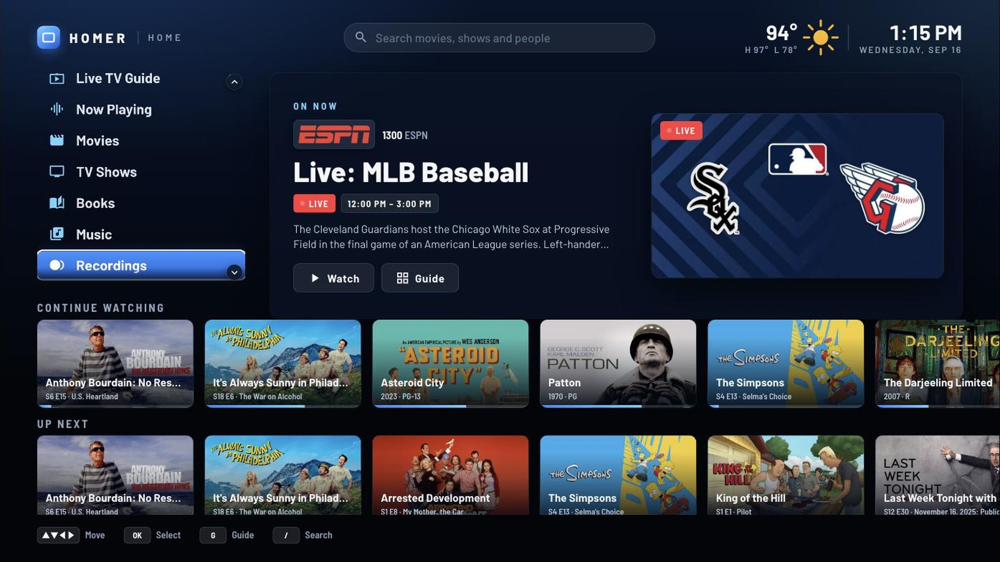

- **B. An icon rail** — a narrow column of large icons the height of the
  screen, the focused one naming itself in a tab beside it. It fits any number
  of items without scrolling (they share out the height), and the On Now
  panel, the rows and the Now Playing cards all move left into the ~300px it
  gives back.

  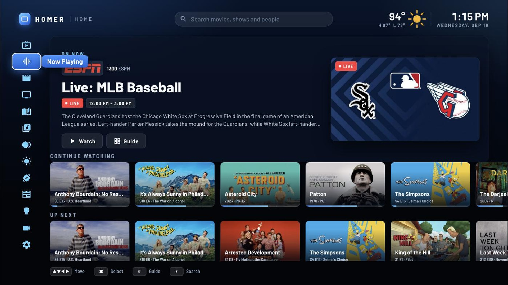

Both work with a remote (▲▼ move, OK selects, ▲ off the top item goes to the
search box), a mouse and touch. On a phone there's no column for either, so
the same list is a sheet: tap the HOMER mark in the top bar (see
[On a phone](#on-a-phone)).

Clicking (or pressing OK on) the item for the screen you're already on goes to
the top of that screen instead of navigating again — Music's album wall from
inside an album, the Movies or TV Shows grid from a details page, House's room
list from a camera or a room, and so on. At the top of a flat screen it does
nothing, on purpose: going Home from the item you're standing on was the bug.

### Live TV and House: one item, a strip of tabs

**Live TV** is the guide and the DVR (Recorded, Scheduled, Series) together:
the guide is the first tab, the other three are the same Recordings screen as
before, drawn as tabs of one place instead of two separate menu items. **G**
still opens the guide from anywhere, and `#/livetv?tab=3` still opens
Recordings directly.

**House**, once Home Assistant is connected, is Rooms and Cameras together the
same way — Rooms first (with Who's Home above the rooms), Cameras a tab over.
The doorbell is still two presses away, not a trip back through the menu.

### Radio is its own item

**Radio** (`#/radio`) is the Music screen's Radio tab, promoted to a menu item
of its own — same code, same station list and favourites, just without the
rest of Music's tabs around it.

### Weather isn't in the menu

The forecast (`#/weather`) is reached from the weather bug in every screen's
top bar, not from the main menu — the list only has so much room a sofa can
read. The bug is a real button now: click it, Tab to it in a browser, or on
Home ▶ out of the Search box reaches it by remote (◀ back, ▼ into the menu).
`W`, or holding OK on an Apple TV remote (the Actions strip), opens it from
any screen.

## Watching while you browse

A video keeps playing while you move around HOMER. Every HOMER screen (Home,
Movies, TV Shows, show and movie pages) has a preview window, and the video
sits in it, still playing, as you go from screen to screen.

- **Back** from full screen (the player's ← button, **Esc** or **Backspace**)
  shrinks the video into the screen you came from, and it keeps playing there:
  the show or movie page you pressed Play on, or the guide you tuned the
  channel from (back where you were in it, with the screen you opened it over
  underneath).
- **Full screen**, **F**, or a click on the preview window takes it back to
  full screen. **Play** on something else also goes full screen.
- **H** or the player's **Home** button takes the video to Home's preview.
- **Stop** on Home ends it. When a video ends by itself, you stay on the screen
  you're on.
- While a video plays behind HOMER, the arrow keys, space and the trackpad
  control HOMER, not the player. The trackpad never changes the volume, even
  in the full-screen player.
- The browser's own Back (a phone's back button or swipe, the trackpad swipe,
  Cmd+[) goes back a screen and the video keeps playing. From Home, where
  there's nowhere to go back to, it stops the video. In full screen, if the
  video was in a preview window before, it shrinks it back there, like **Esc**.
- Jellyfin's own pages (the dashboard, sign-in) still stop the video when you
  open them, because Jellyfin stops video whenever you leave its player.

### Skipping commercials

On a recording, or anything else with a timeline, the full-screen player's
**Skip 30s** button (where Jellyfin's fast-forward was), **S**, or a remote's
fast-forward jumps ahead 30 seconds: one commercial. Presses add up (+1:30
shows at the top) and the video jumps once you stop, so a whole break is one
jump. Jellyfin's ◀ (back 10 seconds) takes back an overshoot. Live TV has no
timeline, so the button isn't there.

## Movies and TV Shows

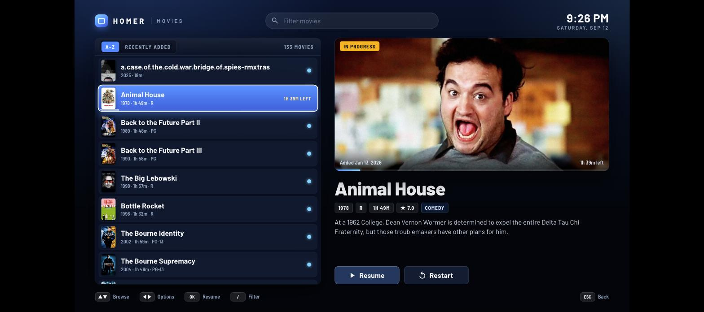

Movies and TV Shows open in a "My Shows" style list: titles on the left, the
selected one's art, details and Play / Resume / Restart on the right. A show
opens to season tabs over an episode list. Arrow keys move, OK plays, Esc goes
back.

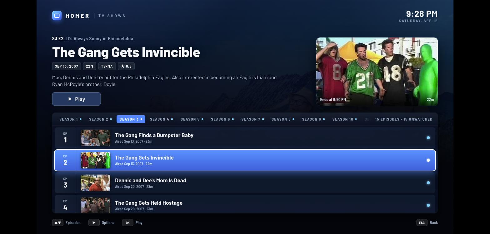

### Narrowing it down

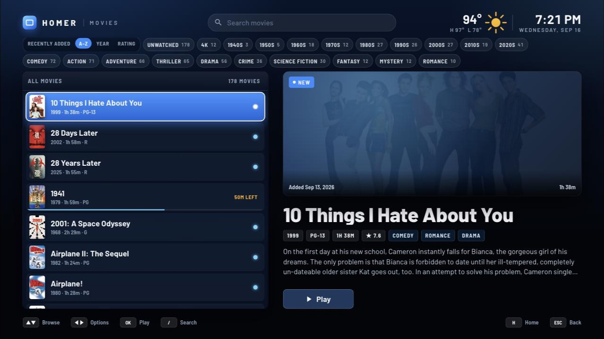

Two rows of chips sit above the list. The top row is the order — **Recently
added**, **A–Z**, **Year**, **Rating**, and **Recently aired** on TV Shows —
then the filters that don't care what a title is about:

- **Unwatched** — a movie you haven't finished, a show with episodes left.
- **Favourites** — anything hearted in Jellyfin.
- **4K** — titles in 2160p. Jellyfin answers this one itself, so it costs a
  second small query and no extra work per title. A library with nothing in 4K
  doesn't get the chip, and nor does one with no favourites.

The second row is **genre** and **decade**: the genres this library actually
leans on, most-used first (ten of them, not the forty Jellyfin knows), and the
decades its years really fall in. Everything combines — Comedy *and* the 1980s
*and* unwatched — and the search box (**/**) narrows whatever is left.

Every chip carries the number of titles it would leave you with, counted
against everything else that's already on, so a dead end shows itself before
you press it (a chip that would leave nothing goes dim and dashed). The list's
header says what's on — `COMEDY · 1980S` — beside `11 of 178`.

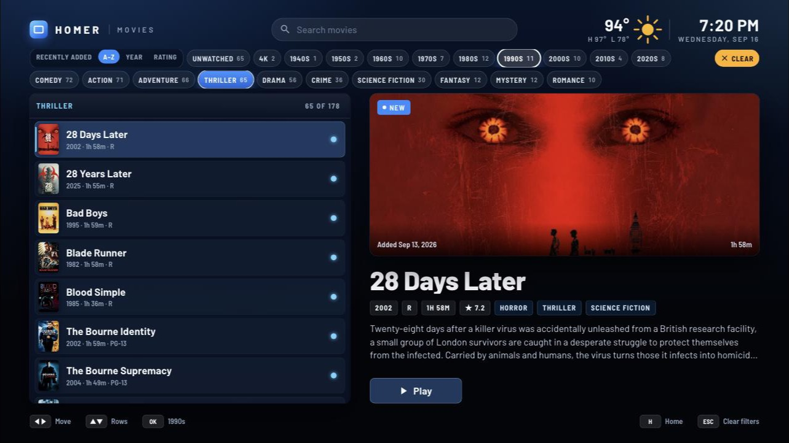

**▲** off the top title moves up into the bottom row, **▲** again into the top
one, **◀ ▶** run along a row, **OK** presses, and **▼** drops back onto the
title you left — the same as the guide's chips. Pressing a lit chip turns it
off. **ESC** takes every chip and the search box off in one press, and an amber
**Clear** chip appears at the end of the top row while anything is on.

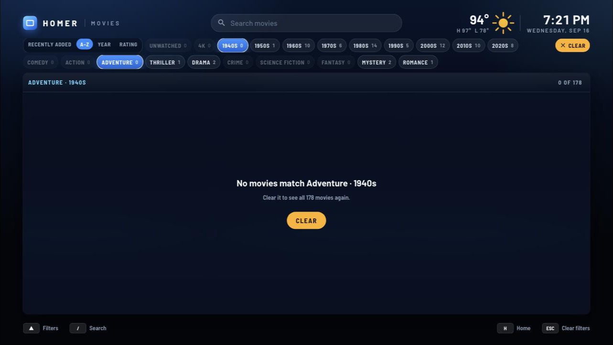

When a combination leaves nothing, the screen says which filters did it and
offers the same one press out.

What you were last looking at comes back if you leave Movies and return — but
only for this sitting. A filter isn't a setting: come back tomorrow and the
whole library is there again. (The sort *is* a setting, and is remembered per
library.)

### What's out there

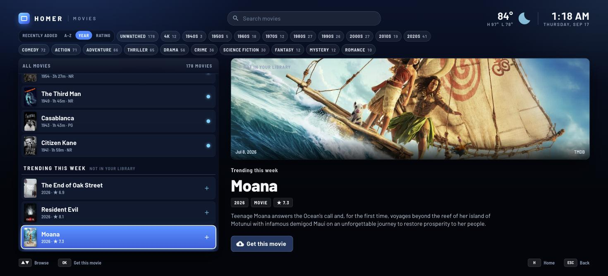

Under your own titles, both screens carry rows of what you *haven't* got —
**Trending this week**, **In theaters now** (**On the air** on TV Shows) and
**Coming soon** — from [TMDB](https://www.themoviedb.org). **▼** off the last
title drops into them, **▲** off the first one comes back, and **OK** on any of
them hands it to Radarr or Sonarr: the same two-press confirm as everywhere
else ("Get this movie? Press OK again"), the same chips and flags
("Not in your library", "Downloading 42%"), and the same result — it starts
downloading. A show's three choices are there too: **Get new episodes**, **Get
every episode**, **Get the latest season**.

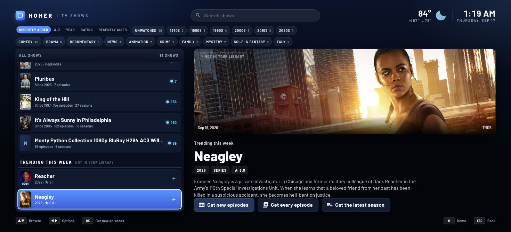

Anything already in the library is left out of these rows, so they only ever
show things that would be new. The filter chips narrow *your* library and have
nothing to say about TMDB's, so the rows stand down while any chip is on; the
search box narrows them by title along with everything else.

On a movie's page, **More like this** sits beside About; on a show's page it
sits under the season's episodes. Same rows, same one press to get one.

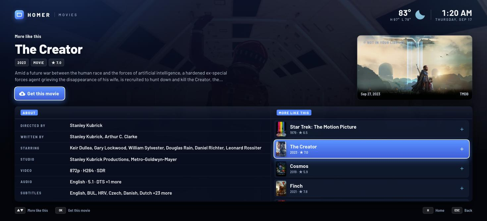

TMDB hands out TMDB ids and Sonarr wants TheTVDB's, so a show's is looked up
(TMDB's external ids, then Sonarr's own search) before the button is pressed —
there's no such thing as a dead Get button here.

**This needs a TMDB key**, and without one none of it draws: no rows, no
headings, no error — Movies and TV Shows are exactly what they were. The key
lives on the NAS with HOMER's helper and never reaches the browser or this
repository. One is already installed; to replace it (a free key comes from
themoviedb.org → your account → **Settings → API**), one command:

```sh
ssh 192.168.68.100 'umask 077; printf %s "YOUR-KEY-HERE" > /Volume1/docker/mediastack/config/homerfeeds/tmdb.key'
```

It takes effect within ten seconds — nothing to restart — and running it again
just replaces the key. To keep the key out of your shell history, leave it off
the command and paste it instead:

```sh
ssh 192.168.68.100 'umask 077; cat > /Volume1/docker/mediastack/config/homerfeeds/tmdb.key'
```

then paste the key and press Ctrl-D. TMDB's v4 *read access token* works too,
in `tmdb.token` beside it (it's preferred when both are there). Deleting the
file turns the rows off again. These rows are the TV layout's; the phone
layout's Movies and TV Shows don't show them yet.

### Play on… (a movie or episode on another screen)

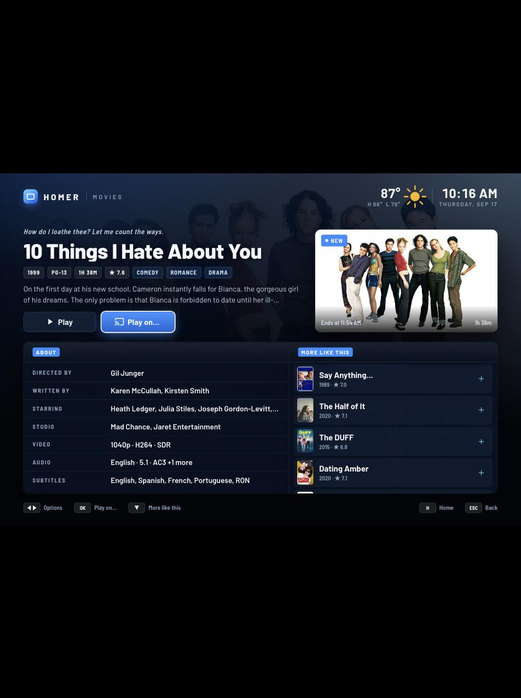

**Play on…** sits beside Play and Resume/Restart on a movie's page and an
episode's or a show's, and sends it to another screen in the house instead of
playing it here. It's only offered when there's actually somewhere to send
it to — Home Assistant connected, or Jellyfin's own `/Sessions` — and both of
those usually settle *after* the page has already drawn once, so the button is
kept in step rather than decided at draw time: it can appear a moment after
the page does, and disappear again if a session drops.

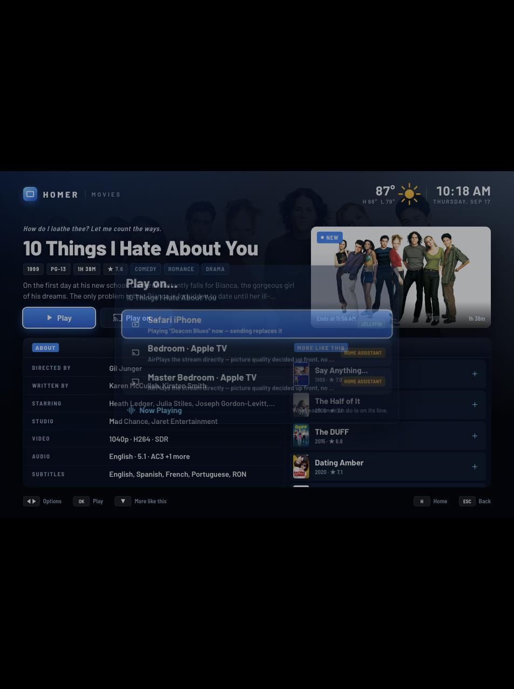

Unlike an album, a movie can't go out as an M3U — there's no such thing as "a
few seconds of video, enqueued" — so the picker chooses honestly between two
real, unequal routes per device, and says which one on the row:

| Route | How | What you get |
| --- | --- | --- |
| **Jellyfin** | Every other live Jellyfin client, from `GET /Sessions` — a phone, a TV app, another browser. `POST /Sessions/{id}/Playing` hands it the item the same way the guide already remote-controls a session. | The real thing: resume points, subtitles, direct play, proper scrubbing, and it reports straight back into `/Sessions` — HOMER's Now Playing already understands it. |
| **Home Assistant** | A Chromecast, an Apple TV, or a DLNA/UPnP renderer, handed an opaque address minted by the NAS helper (`POST /video/cast`) that redirects to a Jellyfin transcoding address (forced to H.264/AAC) through `media_player.play_media`. | Reaches a screen with no Jellyfin app running, but the picture quality is decided up front, there's no resume and no subtitle menu, and nothing reports back. |

Only a device actually running a Jellyfin client gets the first row; only a
Home Assistant platform HOMER has verified actually fetches a media URL gets
the second (`cast`, `apple_tv`, `dlna_dmr`, `upnp` — **not** `samsungtv`,
`webostv` or `androidtv`, whose `play_media` launches an app by id rather than
playing a file, and not a device that only reaches Home Assistant through
Music Assistant's own player wrapper, which is built and tested for audio).
A device reachable both ways only shows once, as the Jellyfin row — matched by
a loose overlap of words between the Home Assistant entity's name and the
session's device name, not a real fingerprint, so an unmatched pair can in
principle appear twice.

**The Home Assistant route's URL carries no Jellyfin token.** Like the album
picker, it mints a short-lived, opaque address on the NAS helper first
(`POST /video/cast`, one item instead of eleven) — the token stays on the NAS
and only the `/video/c/<key>` redirect it hands back ever carries the real
one, straight to the device doing the playing, never through Home Assistant's
logbook, recorder, or a debug log that repeats the service call.

## Weather

Home's **Weather** item opens a forecast board laid out like a TV weather
segment, for the same place as the clock's weather (set per device in
Settings → Weather location):

- A title band with the place and what's coming, in a sentence.
- **Now**: the temperature and conditions, feels like, humidity, wind, and the
  next sunrise or sunset. Below them, the next 14 hours two at a time:
  conditions, temperature and chance of rain.
- **Radar**: the last hour of the National Weather Service's radar, played as
  a loop over a navy map centered on the place (county and state lines, dim
  interstates, the bigger towns), with the time of each picture. The rain is
  exactly as the NWS draws it. US only; elsewhere the panel says there's no
  radar.
- **Next 3 days**: a panel a day with conditions, high and low, chance of rain
  and how much, wind, sunrise and sunset.

Now and each day sit on an illustrated sky that matches the weather (and, for
Now, the time of day: day, dawn, dusk or night). The forecast refreshes every
10 minutes while the screen is up, the radar every 5. Data from Open-Meteo and
the National Weather Service.

## Alerts

One strip, over whatever is on screen — Home, the guide, a hub, a phone, or a
video playing full screen. Two things put messages on it, and only ever one
message is up at a time.

**Severe weather** comes from the National Weather Service
(`api.weather.gov`, free, no key, answers a browser directly). Where the house
is comes from Home Assistant's own config; with Home Assistant not connected,
HOMER's weather location (Settings → Weather location) answers instead. It's
polled every five minutes, and every minute while a warning is up.

**The house** comes from Home Assistant, from the same sensors a room's
[At a glance](#rooms-home-assistant) line reads — one list of what matters,
not two:

| What | When it says so |
| --- | --- |
| Smoke, carbon monoxide or gas | The moment the detector trips |
| Water | The moment a leak sensor trips |
| The garage left open | Open 5 minutes |
| A door or window left open | Open 10 minutes |
| The doorbell | It rang; gone again 3 minutes later |

Open is normal; open *for a while* is the thing worth saying, which is why the
doors wait. Motion and occupancy never raise one — a crawl that says somebody
walked through the hall is a crawl nobody reads.

### How loud it is

A tornado warning is not a frost advisory, so there are three levels, and for
the weather the NWS's own `severity` and `urgency` fields decide which — not
the event's name, which changes.

| Level | What it is | How it behaves |
| --- | --- | --- |
| **Extreme** | `severity` Extreme, happening now or expected: a tornado warning, a hurricane warning. Smoke, CO or gas at home. | Red, the edge pulses, stays up until you dismiss it or it clears |
| **Warning** | `severity` Severe, happening now or expected: a flash flood warning, a severe thunderstorm warning. Water at home. | Red, stays up |
| **Notice** | Everything else: watches (Severe, but `urgency` Future), advisories, statements. A door left open, the doorbell. | Quiet, and takes itself back down after 24 seconds — 10 over full-screen video, where an advisory has no business sitting |

That one pair of fields is the whole difference between a **Flood Watch**
(Severe / Future → notice) and a **Flash Flood Warning** (Severe / Immediate
→ warning). Test and exercise messages, and cancellations, never show.

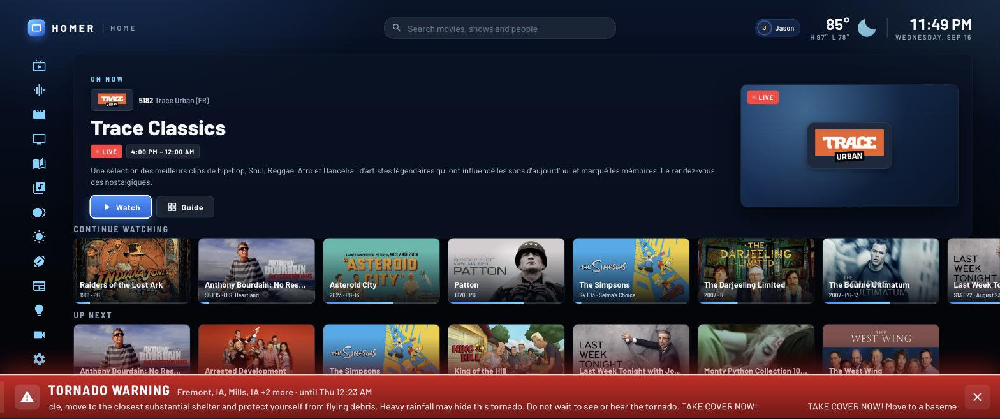

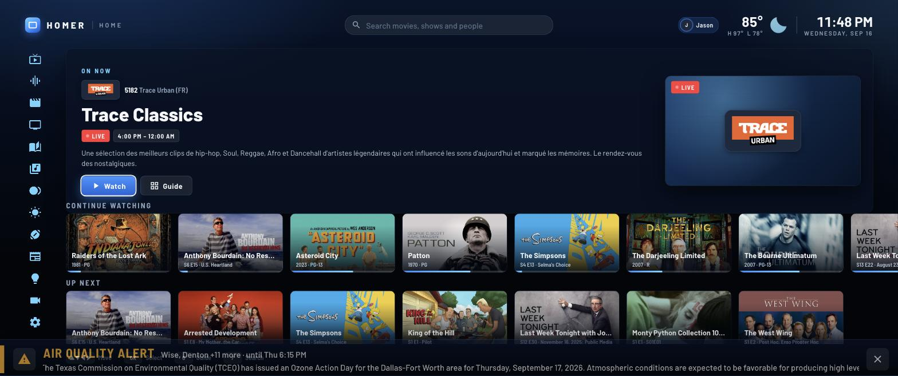

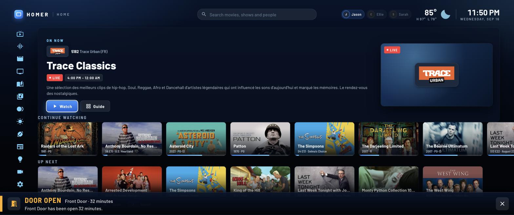

### Living with it

- **One strip, one message.** Loudest level first, newest within a level.
- **Esc**, or the ✕, dismisses the one showing and the next takes its place.
  HOMER remembers what you've dismissed until that alert itself clears, so the
  same door doesn't announce itself on every screen you open — and the same
  door tomorrow does.
- **It never takes focus and never moves the screen underneath.** It's fixed,
  over everything; nothing on it is in the tab order, and Esc only belongs to
  the strip while a message is showing — the next Esc is the screen's own Back.
- **Over full-screen video** it's a lower third, lifted clear of Jellyfin's
  transport controls, never a dialog.
- It hides itself while the **Actions strip**, the **quick controls** panel or
  the phone's **menu sheet** is open: those are asking for an answer.
- A remote with no Esc reaches it through the Actions strip: **Dismiss alert**,
  and **Weather** for a weather alert.

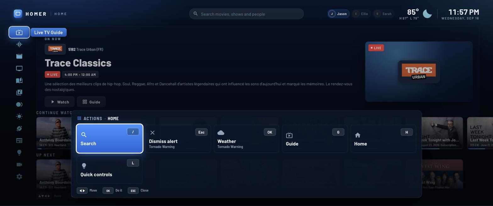

### Trying it when the sky is clear

HOMER ships no made-up alert. There is usually nothing active near the house,
so feed it a real one the NWS has already issued — `api.weather.gov` keeps the
recent ones and answers a browser directly, so this is the whole of it, from
the console:

```js
HomerAlerts._fetch('https://api.weather.gov/alerts?event=Tornado Warning&message_type=alert&limit=1')
HomerAlerts._fetch('https://api.weather.gov/alerts?event=Flood Watch&message_type=alert&limit=1')
HomerAlerts._live()   // back to the house's own alerts
```

The payload is the NWS's own, word for word. `message_type=alert` matters: the
newest entry for an event is often its cancellation, which HOMER (correctly)
drops. Its times are in the past, so `_feed` re-dates it to now — otherwise it
reads as expired and never shows; that, and nothing else, is changed.

## Rooms (Home Assistant)

With [Home Assistant](https://www.home-assistant.io/) connected (Settings →
Home Assistant), HOMER has a **Rooms** screen, quick controls over whatever's
playing, and a doorbell picture-in-picture. Nothing about Home Assistant is in
HOMER's code or the injector config except, if you like, its address.

- **Who's home** is the first band of Rooms, above the rooms themselves: a
  card a person, their picture where Home Assistant has one and their initials
  where it doesn't, whether they're in, where they are — **Home**, or the
  zone Home Assistant has them in (**Work**, **School**) — and how long
  they've been there (**since 4:12 PM**, **2 h**). Whoever's in reads lit and
  in color, whoever's out flat and grey. ▲ from the first room goes up to
  it and ▼ comes back down; nothing on it is a control, so **OK** does
  nothing there. Holding **OK** on an Apple TV remote (the
  [Actions strip](#actions-for-a-remote-with-no-letter-keys)) has **Who's
  home** from any screen, which opens Rooms with the band focused. It's read
  only — HOMER asks Home Assistant where people are and changes nothing, and a
  house with nobody to show gets no band at all.

  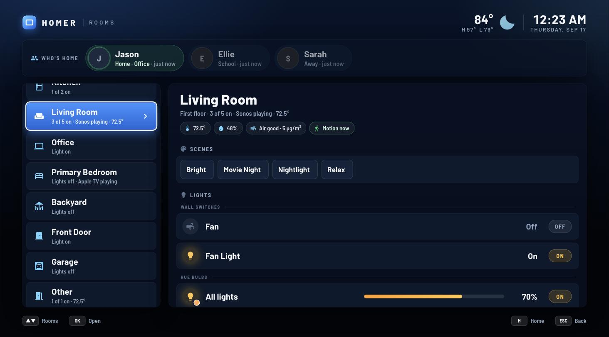

- **Rooms** (House, on Home's menu, or **Rooms** at the top of Home on a phone) lists
  Home Assistant's areas, with what's on and the temperature, plus
  **Cameras** for every camera and **Climate** for the thermostat. A room
  shows, top to bottom:
  - **At a glance** (read only): who Home Assistant places in the room, its
    temperature and humidity, a door or window left open, motion now, the air
    (PM2.5, AQI, CO₂), smoke or a leak. (The same buckets the
    [alert crawl](#alerts) reads.) Most houses have put none of their people
    in an area, and then the room simply doesn't mention anybody.
  - Its **scenes** (◀▶ picks, OK turns one on).
  - Its **lights**: wall switches first, then the bulbs (the room's own group,
    **All lights**, first). ◀▶ dims in 10% steps, OK switches. A bulb that
    does color has a dot in its color; **C** opens its colors: presets, a
    warm-to-cool white strip and a color strip.
  - Its **cameras** (OK opens one).
  - **Switches & outlets**: plugs and power strips (a strip's own switch is
    **All outlets**).
  - **Media**: a card per player: what's playing and its art, ◀▶ for the
    volume and OK to play or pause on the card, then its buttons (**Remote**,
    skip, mute, power) and its inputs. A speaker group shows once, under the
    speaker leading it; the same speaker or TV coming in through two
    integrations (itself, DLNA, Cast) shows once.
  - **Fans** (an air purifier): on and off, its speed or modes, and the
    device's own settings under it (a child lock, a favorite level).
  - **Automations & helpers**: automations (on is enabled), toggles, and
    scripts and buttons to run.

  What's left out: sirens and anything that sets one off, alarm panels,
  hidden and settings/diagnostic entities, buttons that restart or reset a
  device, and devices whose integration isn't running (Home Assistant only
  remembers them). Anything else that's unavailable is dimmed with no
  controls. Esc goes back a step. On a phone the rooms are chips along the
  top, with the same sections; tap a bulb to switch it, drag its bar to dim,
  tap its color dot for its colors.
- **The remote.** A player that's an Apple TV or a Samsung TV (Home
  Assistant has a `remote` for it on the same device) has a **Remote**
  button on its card, and one in the quick controls. It opens the whole
  remote: a ring of arrows around OK, then Back, Home (an Apple TV's TV
  button), Play/Pause and the volume, next to the device and what's on it.
  Your remote goes straight to the device — arrows, **OK**, **Esc** or
  **Backspace** for Back, **Space** for play/pause, **+** and **−** (or
  **Page Up/Down**) for the volume, **T** for Home — and each press lights
  its key on screen; a held arrow repeats about six times a second. **H**,
  or **Back** held down, hands the keys back to HOMER. On a phone it's a
  round pad you tap, with Back, Home, Play/Pause and the volume under it,
  and a light buzz on each press. A video playing docks beside the remote.

  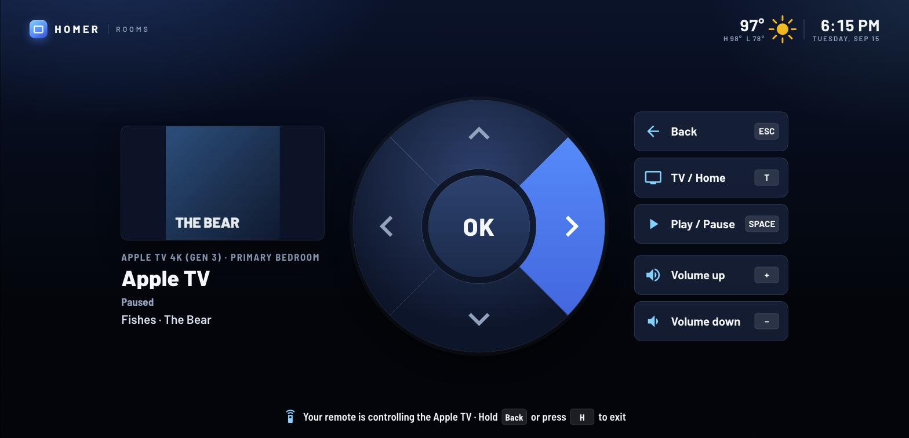

- **A camera** opens large, live when the camera streams (Home Assistant's HLS,
  played with hls.js, or the browser's own on an iPhone), otherwise a still
  that refreshes every second. ◀▶ goes to the next camera. A doorbell shows
  the day's rings.
- **L** (or the lightbulb in the player's controls) opens the quick controls
  over any HOMER screen or a full-screen video, which keeps playing: one room
  at a time (◀▶ on its name changes rooms), its scenes, its lights, what its
  players are playing (◀▶ volume, OK play/pause), and the house's thermostat
  pinned at the bottom. **L** or **Esc** closes it; it
  closes by itself after 20 seconds. On a phone it's a sheet from the bottom.
- **The doorbell.** When Home Assistant says the doorbell rang (a Reolink
  visitor sensor or a doorbell event entity), its camera comes up small at the
  top right over whatever's on. **OK** opens it in Rooms (a video playing
  docks in Rooms' preview), **Esc** puts it away, and it goes by itself after
  30 seconds.

### Connecting

1. **Settings → Home Assistant → Address**: type your Home Assistant's address
   (for example `http://homeassistant.local:8123`) and press Enter. Or put it
   in the injector script, before HOMER loads, one per HOMER address:

   ```js
   window.HomerConfig = { homeAssistant: {
       'http://<nas>:8096': 'http://homeassistant.local:8123',
       'https://<nas>.<tailnet>.ts.net': 'https://<nas>.<tailnet>.ts.net:8443'
   } };
   ```

2. **Connect**: this goes to Home Assistant's own sign-in page, and back to
   Settings, which then says **Connected to** your home. Home Assistant signs
   in HOMER with this page's address as its name (it's listed under your
   Home Assistant profile's refresh tokens).
3. **Disconnect** (press it twice) signs the device out and tells Home
   Assistant to forget it.

**Where the sign-in lives.** The refresh token isn't just this browser's —
it's kept server-side, in *your Jellyfin account's own* preferences (Jellyfin's
`DisplayPreferences`, a small per-user string bag every client gets; HOMER
uses its own bucket there, never anything shared or server-wide). Every device
signed into HOMER as you picks it up automatically, including a different
HOMER address (Tailscale vs. your LAN URL are different browser origins,
which otherwise can't see each other's storage) and a phone whose browser
dropped its local copy after a week unused. This device's `localStorage` is
still read first and kept as a fast, no-network cache; it's also the fallback
if Jellyfin can't be reached, so a Jellyfin outage doesn't take Home Assistant
down with it. A sign-in from before this existed is adopted into your account
on next load, not thrown away. Disconnect clears both.

This is a real, deliberate trade: the credential that can open your locks and
watch your cameras now lives in Jellyfin, scoped to your Jellyfin user only —
never server-wide, never readable by another account (checked against a
second, non-admin Jellyfin account on a live 10.11 server: it gets its own,
empty bucket back, never yours). If you'd rather not make that trade, don't
connect Home Assistant on a Jellyfin server where you don't trust every
account with your house.

**Home Assistant needs no configuration change** when HOMER and Home Assistant
are both plain `http://` on your network. HOMER talks to Home Assistant over
its WebSocket API (states, rooms, controls, camera streams, history) and uses
its sign-in endpoints (`/auth/token`, `/auth/revoke`) and its camera pictures
and HLS streams, which all answer any page. It never calls Home Assistant's
REST API, so `cors_allowed_origins` isn't needed.

### From outside the house (Tailscale)

An `https://` HOMER page can only reach an `https://` Home Assistant (the
browser blocks `http://` and `ws://` from it). If HOMER is on Tailscale's
`https://<nas>.<tailnet>.ts.net`, serve Home Assistant from the same machine
on another port:

```sh
tailscale serve --bg --https=8443 http://<home-assistant-ip>:8123
```

and set HOMER's Home Assistant address to `https://<nas>.<tailnet>.ts.net:8443`
on those devices. Home Assistant then sees requests coming through a proxy
(the NAS), which it refuses unless it's told to trust it, in
`configuration.yaml`:

```yaml
http:
  use_x_forwarded_for: true
  trusted_proxies:
    - <nas-lan-ip>
```

Restart Home Assistant after changing it. The same two lines cover a reverse
proxy like Caddy on the same NAS.

## Cameras

Once Home Assistant is connected, **Cameras** (the tab next to Rooms on House,
on Home's menu, or the **Cameras** chip on Home on a phone) puts every camera
in the house on one wall and the doorbell's rings where you can see them.

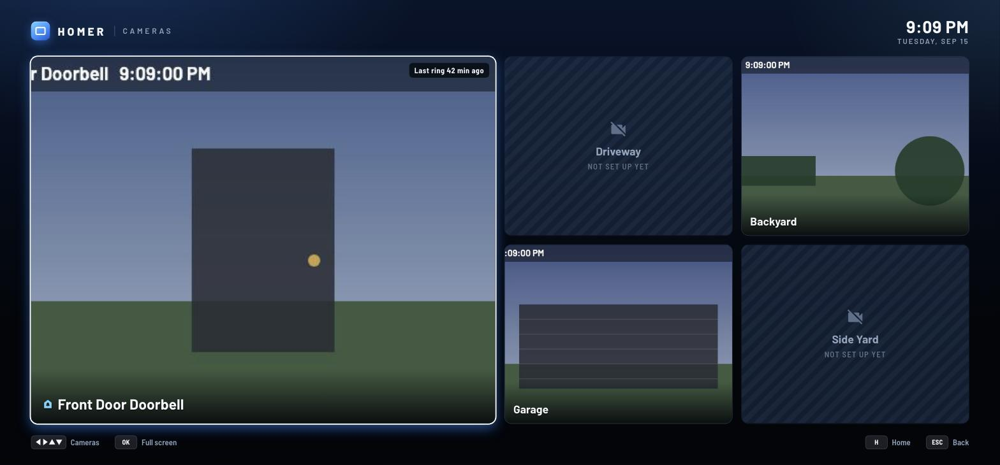

- **The wall.** One tile per camera, the doorbell first and twice the size.
  Every tile shows a still that refreshes every few seconds; the tile you're
  on upgrades to the live stream after a moment, so only one stream ever runs
  at a time. A doorbell's tile says when it last rang. **OK** opens a camera
  full screen, **Esc** comes back.
- **A camera, full screen.** The live view large, the camera's own controls
  beside it, and a strip of what it saw underneath. **▲▼** moves between the
  three, **◀▶** along a row.

  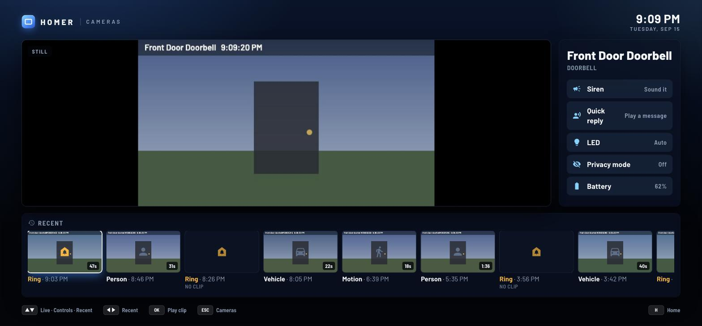

- **The controls** are whatever the camera really has, found on its own
  Home Assistant device: **Siren**, **Quick reply** (plays the camera's first
  quick-reply message), **LED** (Off, Auto, At night, Always on — **OK**
  steps through), **Privacy mode**, and its **Battery** where it runs on one.
  A camera with none of them says so. Nothing else on the device is offered:
  no restart, no firmware, no sensitivity sliders.
- **Recent** is the doorbell's rings and its detections, newest first:
  **Ring · 4:12 PM**, **Person · 3:58 PM**, with the clip's length on its
  thumbnail. Rings are in amber. **OK** plays that clip in the big view;
  **Esc** goes back to live. A ring or a person that Home Assistant saved a
  still of shows that picture — a real look at who was at the door, there in
  well under a second, and there even when the clip isn't.

### Where the rings and the clips come from

A Reolink camera keeps its own recordings, and Home Assistant's Reolink
integration publishes them as a media source (`media-source://reolink`), a
tree of camera → resolution → day → clip. Each clip's title is the
integration's own — `19:00:39 0:02:32 Motion Vehicle Person Doorbell`: the
time of day, how long it runs, and everything the camera triggered on.
**Doorbell** in that list is a ring. HOMER walks the newest days backwards,
reads the exact start out of the media id, and labels each event with the most
telling thing in it (a ring first, then a person, a package, an animal, a
vehicle, plain motion). It asks for the low-resolution copies: the same events,
a quarter of the bytes.

Home Assistant hands out **no thumbnail** for those clips — `thumbnail` is
`null` on every one. So a tile's picture is either a still Home Assistant
saved of that moment (below) or, failing that, the clip's own first frame,
drawn by a paused, muted `<video>`. Two of either load at a time so a battery
camera isn't asked for a dozen files at once, and stills go first: they come
off the server's disk and ask the camera for nothing. A media source that
*does* carry a thumbnail is used as it is.

Where a camera has no clips — it isn't a Reolink, or its recording is off —
the events fall back to Home Assistant's history of the ring and detection
sensors (`history/history_during_period`). Those events have the right time
and no picture, and say **No clip**. Where both have the same moment, the clip
wins. Worth knowing: Home Assistant's recorder often has *no* trace of a ring
(the visitor sensor's pulse is shorter than the recorder's resolution), so the
camera's own clips are the reliable record of a ring, not the history.

### A picture of every ring

So a ring is worth a picture of its own, taken the instant the bell is
pressed rather than dug out of a clip that may never arrive. Two automations
in Home Assistant do it — both named **Doorbell stills: …**, so they sort
together in Settings → Automations, and either can be deleted without
touching anything else:

| Automation | Fires on | Writes |
| --- | --- | --- |
| Doorbell stills: save a picture of every ring | `binary_sensor.front_door_visitor` → `on` | `/media/doorbell/<date>/ring-<stamp>.jpg` |
| Doorbell stills: save a picture when a person is seen | `binary_sensor.front_door_person` → `on` | `/media/doorbell/<date>/person-<stamp>.jpg` |

Both call `camera.snapshot` on **`camera.front_door_snapshots_fluent`**, not
on `camera.front_door_fluent`. The two return the same 640×480 frame in about
the same time, but the snapshots entity supports no stream at all
(`supported_features: 0`): Home Assistant fetches a JPEG straight from the
camera's snapshot endpoint instead of opening the sub-stream and decoding a
frame out of it. Fewer moving parts at the one moment the doorbell is busiest,
and it leaves the stream free for whatever is actually watching.

They trigger on the **state change**, never on a poll — the visitor sensor's
pulse is shorter than Home Assistant's recorder reliably catches, which is the
whole reason a ring could go unrecorded. The person one saves at most one
picture every two minutes, so an afternoon of the same delivery van pacing the
porch doesn't fill the disk.

HOMER reads them back through `media-source://media_source/local/doorbell`, a
folder per day, and lays each still over the event at the same moment: a ring
still finds the ring, a person still finds the person, and the clip (where
there is one) stays exactly as playable as before. **A still that matches no
event becomes one** — given how often the recorder misses the pulse, the
picture is sometimes the only record that anyone rang at all.

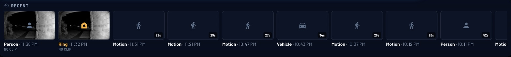

**Housekeeping is manual, and that is worth knowing.** Nothing deletes these.
A still is about 20 KB, so the ring automation alone is trivial (a busy day of
20 rings is 400 KB, a year under 150 MB), but the person automation is the one
to watch: at its 2-minute floor a pathological day is 720 pictures, ~14 MB.
Home Assistant ships no service that deletes a file, so an automation cannot
prune on its own. The two ways out, in order of preference:

1. **A `shell_command`** in `configuration.yaml` —
   `doorbell_prune: find /media/doorbell -type d -mtime +30 -exec rm -rf {} +`
   — called by a daily time-triggered automation. Needs file access
   (Terminal & SSH, or the File editor add-on) and a Core restart to pick the
   new key up.
2. **The media browser**: Settings → Media, or HOMER's own browse, can delete
   a day's folder by hand. Fine for a once-a-quarter tidy.

Until one of those is in place, treat `/media/doorbell` as growing without
limit.

### A camera that's offline

A camera Home Assistant can't reach — a doorbell that dropped off Wi-Fi, a
battery that ran out, an integration whose IP has moved — goes `unavailable`,
and with it every entity on that device. Its tile used to go black and say
nothing. Now it says **Camera unavailable** with **Last seen 7:13 AM** under
it, keeping its name and its room, and the full-screen view says the same in
place of the picture. Nothing asks it for a still or a stream while it's away,
and its own controls (siren, quick reply, LED, privacy) are dimmed and marked
**Unavailable** rather than failing quietly when you press them. It all clears
itself the moment Home Assistant has the camera back — the screen watches, so
there's no reload.

**Recent still works.** The times come from Home Assistant's own history of
the ring and detection sensors, which is on the server, not the camera, so it
is there either way. The clips are on the camera: `media-source://reolink` can
still be browsed a level or two (the integration answers with the camera and
its two resolutions from what it already knows), but the day listing has to
ask the camera itself and fails while it's away. So the strip shows the times
it has and says why the clips are missing — *Its clips are on the camera, and
the camera is offline — they'll be back with it* — rather than looking empty.

### Cameras that aren't up yet

Four cameras are drawn as placeholders, marked **Not set up yet**, so the wall
is the right shape before the bulb cameras go up: **Driveway**, **Backyard**,
**Garage**, **Side Yard**. They're the `PLANNED` list at the top of
`cameras/cameras-model.js`, each with a name and a pattern.

**To make one real, nothing here has to be re-coded.** Add the camera to
Home Assistant (any integration — ONVIF, generic, Reolink) and give its
`camera.` entity a name that matches the slot: anything containing *driveway*,
*backyard* (or *back garden*, *rear yard*), *garage*, or *side yard* (or
*side gate*). Its placeholder becomes the live tile on HOMER's next refresh —
the screen watches Home Assistant, so it appears without a reload. Put the
entity in a Home Assistant **area** and the tile shows the room under the name.

A camera that matches none of the four still shows up: it lands after the
placeholders, in the same wall. So does a second doorbell. Only the *order*
and the held squares come from `PLANNED`; nothing is filtered out by it. To
reserve a fifth square, or change a name, add a line to that list.

## Planes

What's flying over the house right now, on a map, at TV size (`#/planes`,
Home's menu). Jellyfin has nothing at that address.

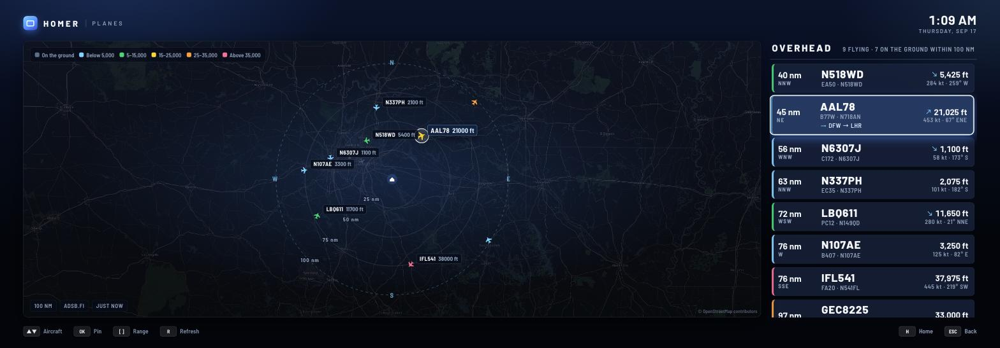

- **The map** is centred on the house, with range rings at round distances and
  a compass, and every aircraft drawn as a silhouette turned to its actual
  track and coloured by altitude — the key sits in the top left corner.
- **The list beside it** is every aircraft in range, **nearest first**: its
  callsign, what it is (type and registration), how high, how fast, which way,
  how far from the house and in what direction, and **where it's going** when
  that's known (`DFW → LHR`).
- **Aircraft on the ground come last.** DFW is 40-odd miles away, so at the
  wider ranges a plain distance sort buries everything actually overhead under
  a hundred airliners sitting still at their gates. They're still listed, in
  distance order, just not at the top — and they're drawn dimmed on the map.
- **Range**: 10, 25, 50, 100 or 150 nm, on `[` and `]` (or `-` and `+`).
  What you pick is remembered on that device.

### Following one

**OK** on the highlighted aircraft follows it: the map recentres on it and
**keeps it centred as it moves**, its track draws behind it, and a card above
the list fills in with everything the feed knows — the aircraft and its
operator, the route in words, altitude, speed, heading, climb rate, distance
and bearing from the house, and its squawk. **OK** again, or **Esc**, lets it
go.

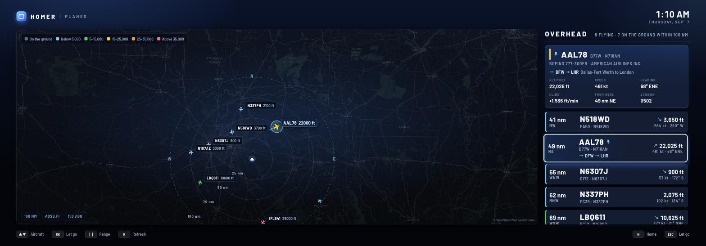

Keys: arrows move between aircraft, **OK** follows one, `[` `]` change the
range, **R** asks again, **Esc** steps back (following → not following → the
previous screen), **H** goes Home. The Apple TV's remote reaches all of it
through the Actions strip (hold **OK**): *Follow it*, *Wider*, *Closer in*,
*Refresh*.

### Where the data comes from, and being polite to it

Two donated, keyless ADS-B feeds: **adsb.fi** (`opendata.adsb.fi`) and
**adsb.lol**. Neither sends CORS headers, so a browser can't call them itself
— HOMER's helper on the NAS does it (`/homer-feeds/planes`, `homerfeeds.py`).
adsb.fi is asked first because its answers carry the aircraft description and
the registered operator; adsb.lol is the reserve. A destination isn't in an
ADS-B message at all, so callsigns are looked up once in **adsbdb.com** (free,
keyless) by a background worker doing a couple a second, and kept for a day.

These are feeds somebody else pays for, so:

- **one request every 7 seconds while the screen is open, and none when it
  isn't** — nothing here has a timer until a Planes screen asks for one;
- **nothing while the page is hidden**, and the poll picks up again when it
  isn't;
- **one answer per place, shared** — the helper caches by rounded position, so
  a second TV in the same house costs the feeds nothing;
- **the last good answer when the feed is down**, marked as old, rather than
  asking again and again, and a failed request backs off to a minute.

### The map's tiles

**OpenStreetMap's own tiles**, fetched through the same NAS helper
(`/homer-feeds/planes/tile/<z>/<x>/<y>.png`) rather than straight from the
browser. That's what makes it allowed under the
[OSMF tile usage policy](https://operations.osmfoundation.org/policies/tiles/):
the helper sends a User-Agent that names HOMER (a browser can't be made to),
keeps every tile on the NAS for a month so a tile is fetched once and never
again (the policy asks for at least seven days), asks only for tiles somebody
is actually looking at — never a pre-seeded area or a range of zooms — caps
zoom at 13 so it can't become a way to scrape a city, and the attribution is
drawn in the corner of the map. It's one house looking at one neighbourhood,
so the whole set is a few dozen tiles. It also solves the other half of the
problem: the helper answers over https on `media.nel.sn` through the same
Caddy route as the news feeds, so the map works from outside the house.

The tiles are a light map, so they're inverted, turned back to the right hue
and dimmed into HOMER's navy rather than dropped on top of it. If a tile never
arrives, the map is still a working radar scope: the ground, the rings, the
compass and the aircraft are all drawn locally, not fetched.

### When there's nothing to show

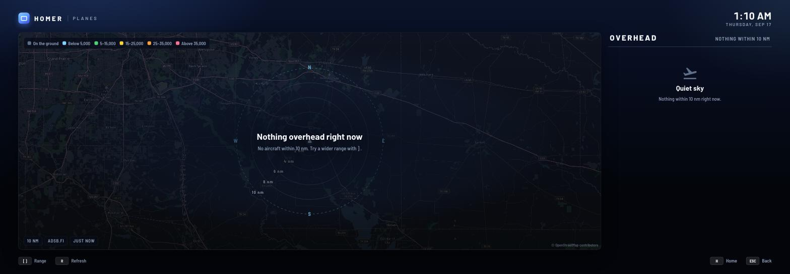

- **Nothing overhead**: the map says so over the rings and the list says
  *Quiet sky*, with the range it's looking at and the key that widens it.
- **The feed is down**: *Can't reach the plane feed*, with what went wrong and
  **OK** to try again. A list that's already up stays up, marked *feed quiet*,
  rather than being thrown away.
- **No location**: *HOMER doesn't know where the house is*, with **OK** to
  Settings. Where the house is comes from Home Assistant's own config
  (`HomerHA.location()`), then HOMER's weather location.

## Sports and News

Two hub screens, each built the same way: a TV window that plays a channel
while you browse, the channels for that subject under it with what's on now,
tabs of content on the right, and a ticker along the bottom.

- **Sports** opens on ESPN. Tabs: My Teams (Rangers, Cowboys, Longhorns,
  Arsenal), MLB, NFL, College FB (AP Top 25, SEC, Big 12), Soccer (Premier
  League, Champions League), NBA, NHL, College Hoops. Scores, standings and
  rankings come from ESPN's public API.
  - **A game's card names its channel, and OK watches it — but only once
    it's actually live.** Before then, or once it's over, the card still
    names the network; OK just says so, it doesn't tune anything.
  - **Regional networks resolve to the right feed, not the first one
    found.** "FOX" (or a team's own regional network) can be more than one
    channel in the lineup — a network's own subchannel, a second channel
    with the same listings, two different games both nominally "on FOX"
    while only one of them is what the local affiliate is actually airing.
    `sports/sports-data.js`'s `resolveChannels()` asks the guide what each
    candidate channel is showing during the game's window (one batched
    `/LiveTv/Programs` call for what's on screen, not one per game) and
    keeps the one whose listing actually names both teams. Exactly one match
    resolves the channel; no guide data yet (it runs about 3 days out), a
    mismatch, more than one plausible channel, or a listing that's a replay
    all leave the game a named network with no channel number — shown, never
    guessed, never tunable.

    | Resolved to a channel | Network only (ambiguous / no data) |
    | --- | --- |
    | 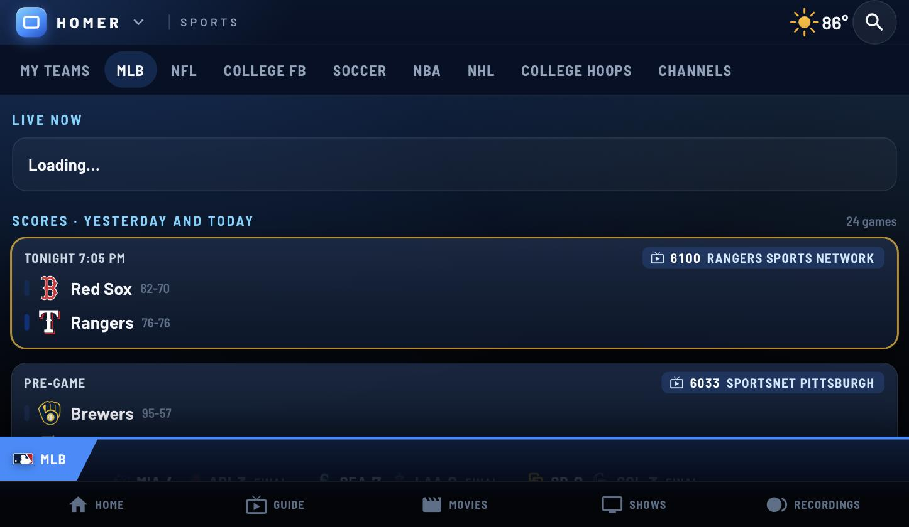 | 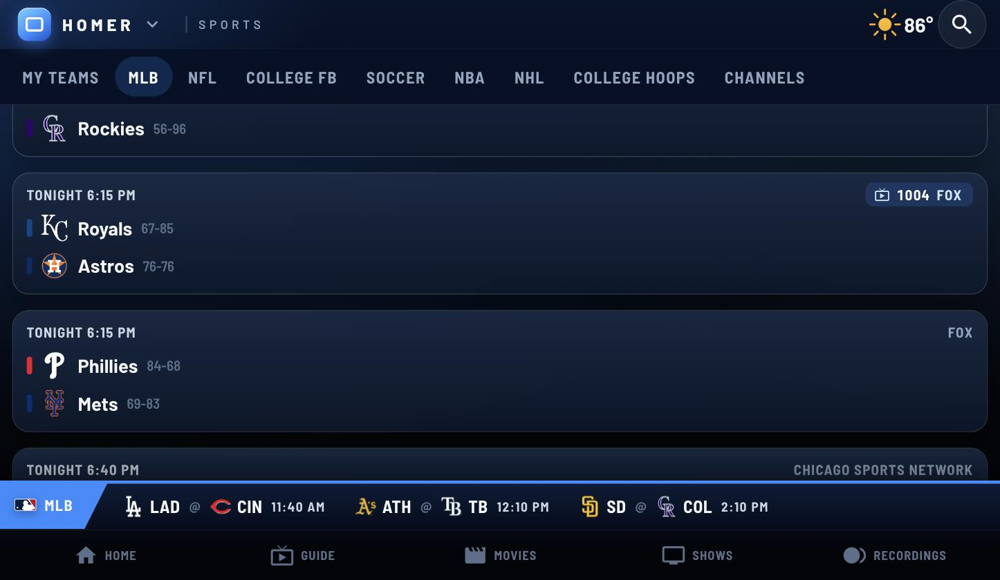 |
  - **Scores split into two groups**: what's live or coming up (with its
    channel, tunable when live), and a **Final** group below of smaller,
    secondary cards — this is a scores section for those, not a what-to-watch
    one. A finished game's card is click/OK-ready for a future box-score
    screen (`#/sports?game=<id>`), not tunable.

    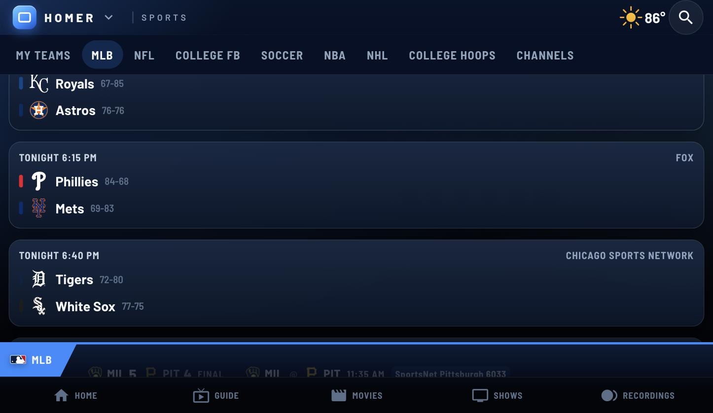
- **Baseball comes from MLB**, not ESPN: `statsapi.mlb.com`, which answers a
  browser directly and knows what a scoreboard knows.

  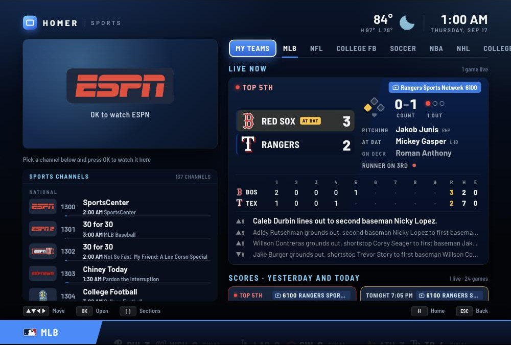

  - **Live now**, at the top of the MLB tab: the two clubs on their own
    colours with the batting side lit, **the bases**, **the count**, **the
    outs**, who's **pitching** and who's **at bat** (and who's on deck), the
    **line score inning by inning** with R H E, and **the last four plays**.
    When more than one game is on, a chip per game across the top picks which
    one the panel follows; the Rangers' is the one it opens on.
  - **The Rangers' card on My Teams** carries the same detail while they're
    playing — bases, count, outs, pitcher, hitter and the last play — and the
    **two probable starters** before they play. Their line reads "76-76 · 2nd
    in AL West", with the magic number or "clinched" once either is real.
  - **Every score card** for a game in progress gets the bases, the count and
    the outs under the score, and the states are the real ones: **Warmup**,
    **Delayed · Rain**, **Postponed**, **Final/10**, **Mid 7th**.
  - Polling is a courtesy: the slate (about 20 KB) every 15 seconds while a
    game is live, a minute when one's about to start, 5 minutes otherwise;
    one game's live feed (about 3 KB) every 12 seconds while the ball's in
    play and slower when it isn't — only for the game on screen and the
    Rangers', never one per game. Nothing is fetched while the screen is
    closed or the tab is hidden.
  - **Live MLB is held back a few seconds so nothing here beats the
    broadcast to a play** (Settings → **Live scores delay**, default 25,
    off to none). StatsAPI's live feed and the slate both take a
    `?timecode=` — the game as it stood N seconds ago — so this asks for
    the past directly rather than buffering: exact, and independent of the
    poll interval. That covers every live MLB surface — the live panel, the
    scores grid, My Teams' Rangers card, and the ticker, since they all
    draw from the same delayed calls. A game that's just gone final isn't
    held back a further N seconds once it's shown as final — but its last
    play is delayed exactly like everything before it, so the walk-off
    isn't spoiled either. Changing the setting takes effect on the next
    poll, no reload.
- **News** opens on CNN. Tabs: Top, US, World, UK, France, Business, Local,
  Tech, from publishers' RSS feeds through HOMER's feed helper on the NAS
  (`/homer-feeds`). OK opens a story with a QR code to read it on your phone.
- The channel list follows Settings → **Guide size** as well: **Large** draws
  its rows about 40% bigger (so about three and a half channels at a time
  instead of five, and it scrolls for the rest), **Standard** as before.
  Changing it there changes an open hub too.
- Keys: arrows and OK; `[` `]` or 1–9 switch tabs; **F** full screen; focus
  the ticker to pause it, ◀▶ to step through it.
- A new hub is a `HomerHub.define({...})` call; see `docs/hubs-notes.md`.

## Now Playing

Everything playing anywhere in the house, on one screen, with the controls for
it (`#/playing`, the menu's **Now Playing** item). No video here — artwork
only.

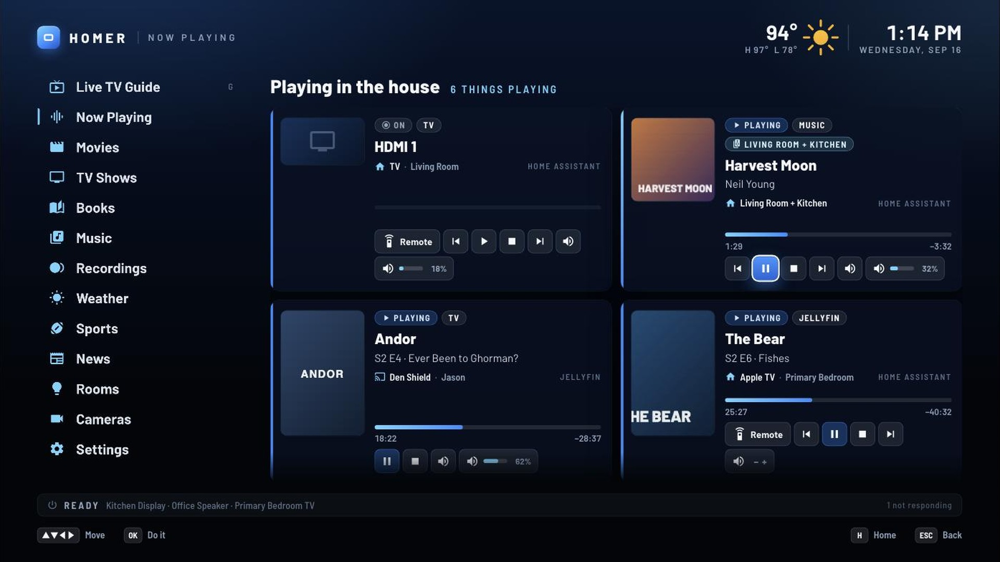

A card is the cover, what's on (the show and the episode, the film, the
track), where it's playing and for whom, a progress bar that keeps moving, and
the controls that player actually takes: ⏮ ⏯ ⏹ ⏭, mute and a volume pill.
Active things are big, one card each, most recently started first; players
that are on but idle collapse into a quiet line at the bottom ("Ready:
Kitchen, Office…") instead of competing with them. The main menu runs down the
left, so this screen is also the way into every other one.

**Where a house player's artwork comes from.** Home Assistant gives a player's
picture as a proxy address on its own server
(`/api/media_player_proxy/<entity>?token=…&cache=…`), and HOMER tries that
first. It doesn't always draw: **Home Assistant's Apple TV integration serves
album art as HEIC**, which is a perfectly good reply — `200`, `image/heic` —
that no browser but Safari can decode, so the `` fails on it. Where that
happens HOMER reads the artwork's real address out of the proxy URL's own
`cache=` parameter (for an Apple TV that is the live Apple Music cover, with
Apple's `{w}x{h}{c}.{f}` template in it, which HOMER fills in) and draws that
instead. Failing both, it looks the same album up in **Jellyfin's own library**
by album, artist and track — the house is playing it, so the server usually
has a copy — and failing all three the card keeps an icon for what kind of
thing is playing, with the track name still large on it. It never shows an
empty box. The cascade is `HomerHA.pictureUrls` / `HomerHA.loadPicture` in
`shared/homeassistant.js`, so Rooms and the quick panel get it too.

It gathers three places something can be playing:

- **Jellyfin's sessions** — every client signed in to the server, from
  `/Sessions`, asked again every few seconds while the screen is open (every
  fifteen when the tab is in the background). Pause, stop and the track skips
  go to `/Sessions/{id}/Playing/…`; the volume and mute go to
  `/Sessions/{id}/Command`, and only appear on a client that says it takes
  them (`SupportedCommands`).
- **The house** — every Home Assistant `media_player` that isn't idle, through
  `shared/homeassistant.js`. Home Assistant pushes its state, so those cards
  need no polling. Speakers playing together (Sonos, WiiM multiroom) are one
  card naming the rooms, with play, pause and the skips going to the one
  leading the group. An Apple TV or a Samsung TV also offers **Remote**, which
  opens the remote Rooms already draws (`#/rooms?remote=…`).
- **HOMER's own music** — the music playing in this browser tab
  (`music/music-model.js`), controlled directly rather than through Jellyfin.
  The Jellyfin session it reports is dropped, so it isn't on screen twice.

Positions are sampled, not streamed: a card carries where it was and when that
was read, and the bar runs on its own between samples, so it moves smoothly
without asking the server every frame.

**Keys:** ▲▼◀▶ move, **OK** does the button under the focus, **◀ ▶** on a
volume pill sets the volume (a press at either end moves the focus on
instead), **R** asks the server again, **Esc** goes back, **H** goes Home.
Holding OK on a remote opens the Actions strip with Play/Pause, Stop, Mute and
Remote for the card you're on.

## Books

Audiobooks from Jellyfin's Books library: the book you're listening to up
top with its chapter ruler, your shelf below, a book page with every chapter,
and a listening screen (chapter and 30-second skips, speed, sleep timer).
Progress is saved in Jellyfin. **P** or Play/Pause pauses anywhere.

## Music

Your own music from Jellyfin's Music library (`#/music`, Home's **Music**
item), and it **keeps playing while you browse HOMER** — the player lives
outside the screens, so leaving Music doesn't stop it. Every other screen gets
a small now-playing strip in the corner with the cover, the track and
◀◀ ▶ ▶▶; clicking it goes back to Now playing.

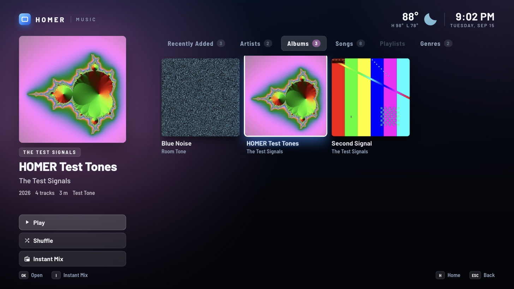

- **Browse** is a column down the left — whatever the focus is on, its cover
  big, who it's by, and **Play**, **Shuffle** and **Instant Mix** — beside a
  wall of album art. Tabs across it: Radio, Recently Added, Artists, Albums,
  Songs, Playlists, Genres.
- **An album** (or a playlist): the cover large and every track, the one
  playing lit. OK on a track starts there.
- **An artist** (or a genre): their albums, with Play all / Shuffle / Instant
  Mix for the lot.
- **Play on…** sends the album to a speaker in the house instead (below).
- **Radio** is a tab of its own: internet radio, which isn't in Jellyfin at
  all — SomaFM, the local Dallas stations, and a search across Radio Browser
  (below).
- **Favorites** is a tab of its own, and a star sits on every track (below).
- **Instant Mix** is Jellyfin's own "radio from this" (`/Items/{id}/InstantMix`)
  and works on an album, an artist, a genre or a track. **I** starts one from
  whatever the focus is on.
- **Now playing**: the cover, the track, artist and album, where you are,
  what's next, and the **lyrics** — the line you're on lit and scrolling when
  the file has timings (an `.lrc` beside it, or lyrics in its tags). Plain
  lyrics show unlit. The right column switches between **Lyrics** and
  **Up next** (the queue; OK on a row jumps to it). A **cast icon** sits in
  the transport row (beside the volume) and, on a phone, at the top of the
  full player too — the same **Play on…** picker (below), one press away
  instead of a hold-OK Action. It shows amber when HOMER already knows it
  sent the current thing to a speaker and that speaker is still going, so
  the button never claims to be idle when it isn't.
- **On a phone, the player sits at the top of the album list** whenever
  something is playing — not a separate screen, the first thing you scroll
  past. It shrinks to a single row once you scroll down to browse and pins
  there, so it never fights the wall for space; scroll back up and it opens
  back out.

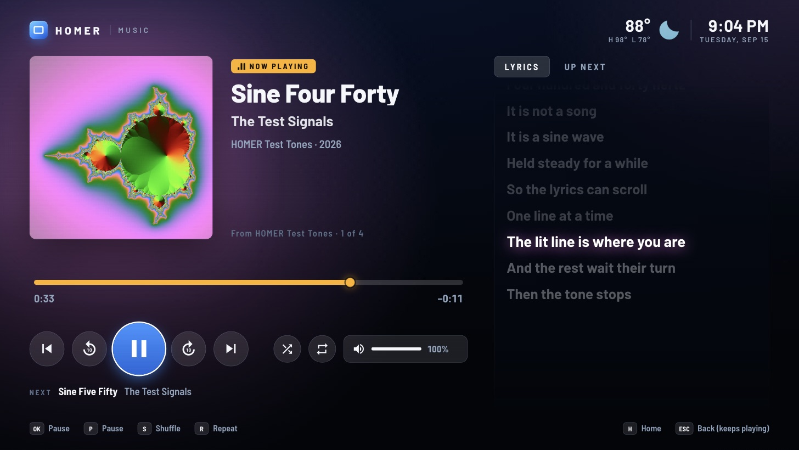

- **Shuffle** keeps the album's own order beside it, so turning shuffle off
  puts the record back in order where you are. **Repeat** is off / all / one.
- Playback is reported to Jellyfin like any other client
  (`/Sessions/Playing`, `/Progress`, `/Stopped`, with the queue), so the server
  knows what's playing and play counts land.
- **Starting music stops HOMER's video; starting a video pauses the music.**
- Not gapless. The next track is preloaded while the current one finishes, so
  the join is short, but the two aren't stitched sample-accurate.

### Favorites

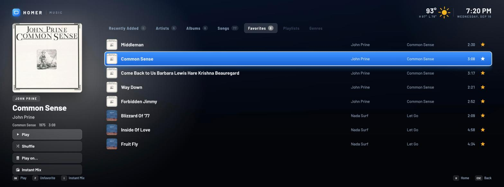

A **star** sits on every track — in the Songs list, on an album, in **Up next**,
and on Now playing — and on an album's own header. Outline when it isn't a
favorite, filled and amber when it is. **F** stars whatever the focus is on
(the track under the cursor, or the album, artist or playlist the page is
about); clicking the star does the same and does *not* start the track. On a
phone the star is its own 44px button beside the row. It's in the Actions strip
too, so a remote with no letter keys can reach it.

**Favorites** is a tab of its own, beside Songs: every track with a star, in
artist and album order, and Play / Shuffle / Instant Mix work on it like any
other list.

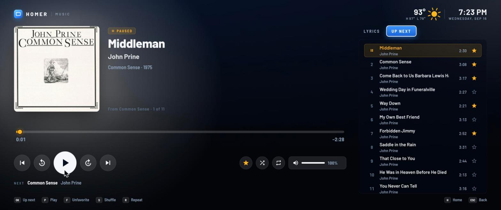

These are **Jellyfin's own favorites**, not HOMER's — a star set here is set in
Jellyfin Web, Swiftfin and anywhere else, and a star set there is already on
the tracks HOMER fetches (`UserData.IsFavorite`, asked for with the lists, so
nothing is fetched twice). The star flips the instant you press it and is put
back if the server disagrees. HOMER writes it with
`POST /UserItems/{id}/UserData` (Jellyfin 10.11), falling back to the older
`POST`/`DELETE /Users/{userId}/FavoriteItems/{id}` on an older server.

### Play on… (an album on a speaker)

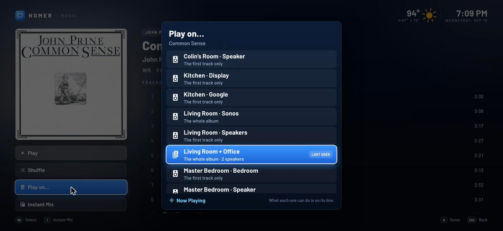

**Play on…** sits beside Play and Shuffle on an album, a playlist, an artist or
a genre, and sends the record to a speaker in the house instead of playing it
in this browser. It's only there when Home Assistant is connected (Settings →
Home Assistant). The list is **This screen** — HOMER's own player, where Play
would have put it — then every Home Assistant player that can take music, with
the device you used last marked and focused. Speakers playing as a group (two
WiiMs, a pair of Sonos) are one row naming both rooms. Arrows and OK, a mouse,
or a thumb on a phone; **Now Playing** at the bottom goes to see it.

**The same picker is also on the player itself** — the cast icon on the TV's
Now Playing screen, and on the phone's player, both the compact row and the
full sheet — for whatever's actually playing right now, so it's one press away
instead of buried in the Actions strip (hold OK) or an album's own sheet.

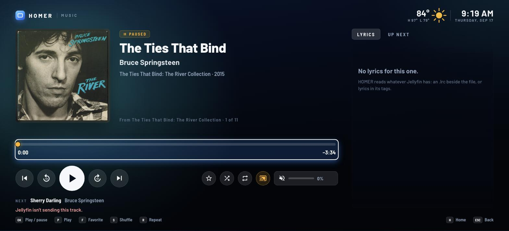
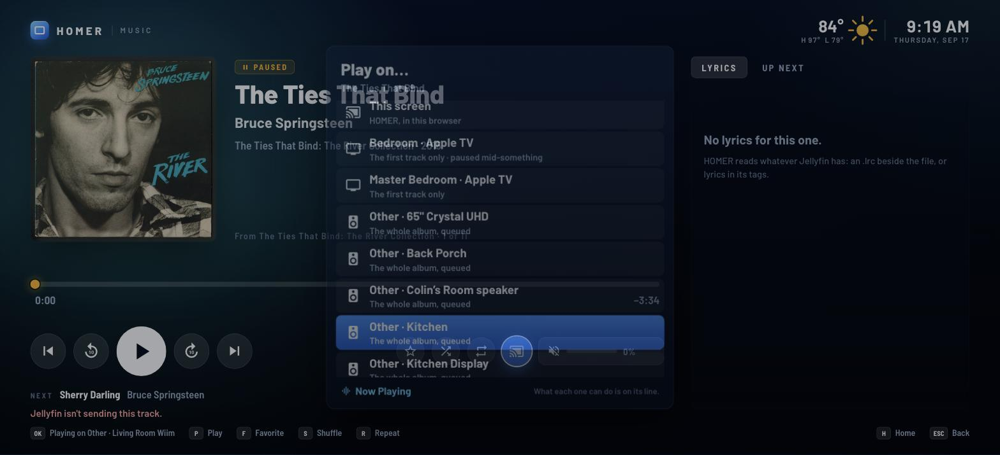

**Every row says what that speaker will actually do**, because they don't all
do the same thing. Home Assistant's `play_media` takes one item and an album is
eleven, so HOMER's helper on the NAS mints a short-lived **M3U** of the album's
Jellyfin streams and hands over that one address. From there it's up to the
player:

| Speaker | What it does |
| --- | --- |
| WiiM and other LinkPlay | The whole album, played as one long stream |
| Sonos | The whole album — Sonos reads a playlist only through its radio player, so HOMER asks it that way, in MP3 (handed FLAC, Sonos skips the record in seconds) |
| Chromecast, Nest, Google TV | **The first track only** — Home Assistant reads the playlist itself and casts the first entry |
| Apple TV | **The first track only** — AirPlay takes one address |
| TVs (Samsung, LG, Android TV) | Nothing: their `play_media` launches apps, not music |
| Anything else | Queued track by track if it advertises it, otherwise the playlist, and one track if it refuses |

A speaker that never says "the whole album" gets the first track **and says so**
on the row and in the message after — it never quietly plays one song and lets
you think the record is on.

**Jellyfin's token never leaves the NAS.** The helper keeps it and hands back
an opaque address (`/music/p/<key>.m3u`, good for twelve hours); the speaker
fetches that. A token in `media_content_id` would be written into Home
Assistant's logbook, its recorder and every debug log that repeats a service
call.

A speaker handed one address mostly reports the address as its title, so
**Now Playing** uses what HOMER remembers sending there: the album's name, who
it's by, and its cover.

### Radio (SomaFM, and real stations)

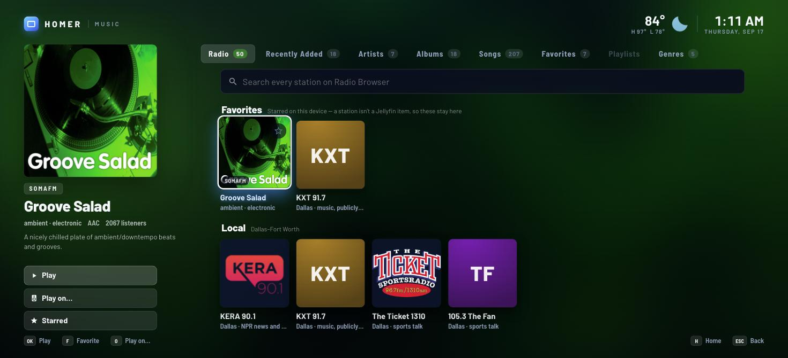

**Radio** is the first tab on the Music screen, and it is the one thing there
that isn't in Jellyfin: live internet radio. It plays in HOMER through the same
player as the library — so the now-playing strip, the media keys, the volume
and Now playing all work on it unchanged — or it goes out to a speaker through
**Music Assistant**.

- **SomaFM**, all 46 channels with their own artwork, in listener order.
  Jason's favourite, so it gets its own row.
- **Local**, the Dallas–Fort Worth four: **KERA 90.1**, **KXT 91.7**,
  **The Ticket 1310** and **105.3 The Fan**.
- **Search** across **Radio Browser** — the open, volunteer-run catalogue
  behind most radio apps, and the closest thing to an open TuneIn. OK on the
  search box starts typing, Enter searches, Esc clears it.
- **Favorites**, the stations you've starred, at the top.

OK on a station plays it here. **O** (or **Play on…** on the hero) sends it to
a speaker. **F** stars it.

#### Where the stations come from

SomaFM is read straight from the browser — `somafm.com/channels.json`, which
answers CORS `*` and whose streams are all https.

Everything else is a **Radio Browser lookup, not a saved URL**. Each of the
four local stations is a name and a station UUID; HOMER resolves the address
fresh each time, and if that UUID has gone it searches the catalogue by name
and takes the best-voted match. So a stream that dies can be resolved again
instead of 404-ing forever. (**105.3 The Fan** is the exception: Radio Browser
doesn't list it at all, so it carries Audacy's own address and says so on its
card.)

Radio Browser asks that apps identify themselves and don't hammer it, and a
browser can't set a `User-Agent`, so HOMER goes through its **helper on the
NAS** (`/radio/rb`), which sends a real one and caches every answer for ten
minutes. Only `/json/stations/...`-shaped paths are passed on. With the helper
unreachable HOMER asks Radio Browser directly.

A Radio Browser station's picture is usually a 32-pixel favicon or a dead link,
so HOMER measures it and, below 64 pixels or on an error, draws a **letter
tile** in a colour of the station's own instead — its call sign if it has one.

#### Playing it

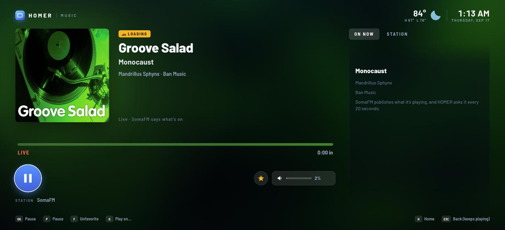

**In HOMER**, a station is a track with no length: the progress bar is a lit
rail, the clock counts up from when you tuned in, and prev/next, shuffle and
repeat are gone — there's nothing to shuffle. Nothing about a station is
reported to Jellyfin's sessions, because Jellyfin has never heard of it.

**On a speaker**, *Play on…* opens the same picker an album uses, in a radio
mode: the list is **Music Assistant's** own players. HOMER calls
`music_assistant.play_media` with `media_type: radio` and the station's plain
stream address, which Music Assistant turns into a `builtin://radio/<url>`
item and fetches itself.

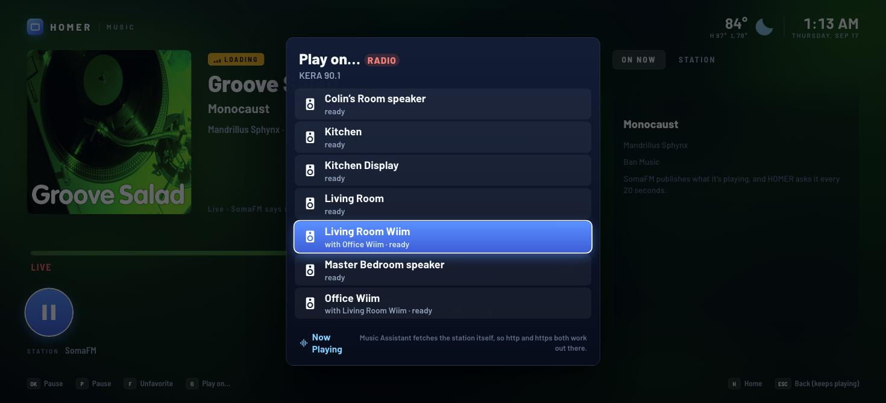

Music Assistant's players are separate entities from the speakers' own (a WiiM
appears twice in Home Assistant, once as `linkplay` and once as
`music_assistant`) and they carry no area, so this is its own list rather than
the room-ordered one an album gets. A player that Music Assistant has grouped
with another says so on its row — **"with Office Wiim"** — because sending to
one of a pair sounds both rooms.

#### What's actually playing on the station

This is the part that varies, so HOMER says which it is rather than pretending:

| Where | What you get |
| --- | --- |
| **SomaFM, in HOMER** | The real track: artist, title and album, from `somafm.com/songs/<id>.json`, asked every 20 seconds |
| **Any other station, in HOMER** | The stream's own **ICY metadata**, where it sends any — usually `Artist - Title`. A browser **cannot** read this off an `<audio>` element at all, so HOMER asks the NAS helper (`/radio/icy`), which opens the stream, reads one metadata block and hangs up |
| **Talk and sports stations** | Usually nothing but the station's own name. HOMER says "this station sends no track information" rather than inventing one |
| **On a speaker** | Music Assistant reads the ICY itself, server-side, and reports it in the entity's state — so a station on a speaker names its track even where the browser couldn't |

#### https, and the stations it breaks

HOMER on the LAN is plain http and plays anything. At `https://media.nel.sn` a
plain-http stream is **mixed content** and the browser kills it silently, so
those go through a narrow relay on the NAS helper
(`/radio/stream?url=…` — http only, since https needs no help, and only if the
far end really answers with audio). A station routed that way says so on its
card: *"Plain http, so HOMER plays it through the NAS helper."* Of the four
locals, only **KERA** needs it; KXT, The Ticket and The Fan are all https.

With the helper unreachable, a plain-http station is marked unplayable here and
stays playable on a speaker — Music Assistant is on the NAS's side of the
problem, not the browser's.

Stations that publish **only HLS** (the BBC's, among others) are marked
unplayable in HOMER on Chrome, which won't play HLS without a library, and play
on a speaker as normal.

#### Favourites are HOMER's here, not Jellyfin's

Every other star in Music is a **Jellyfin** favourite, the same in every client,
because those are Jellyfin items. **A radio station isn't one.** So a starred
station is kept **per device**, in this browser's `localStorage`
(`homer-radio-favorites`), with enough of the station saved that the star still
works when Radio Browser is unreachable. Stars on stations do not follow you to
another device, and nothing about them reaches Jellyfin.

**Keys on the Music screen:** arrows move and OK selects; **Space** or **P**
plays and pauses; **N** and **B** change track; **S** shuffles; **R** cycles
repeat; **I** starts an Instant Mix; **O** opens **Play on…** for a radio
station; **F** stars what the focus is on; **+**
and **−** are the volume; **Esc**
goes back a view, then back a screen (the music keeps playing). On Now playing,
◀ ▶ on the progress bar seeks 10 seconds and on the volume pill changes the
volume. The media keys (Play/Pause, Next, Previous) work from any HOMER screen
while something is loaded.

Nothing is stored outside Jellyfin except the volume, shuffle and repeat, the
speaker you last sent something to — and **starred radio stations**, which
Jellyfin has no item for. All of it is kept per device.

## Getting shows and movies (Sonarr and Radarr)

- Search's **Get it** group lists shows and movies you don't have. OK on one
  asks once, and a second OK adds it to Sonarr or Radarr, which starts
  searching.
- **E** on a series (in Search or the guide) gets all its new episodes.
  Shows already in Sonarr say so ("Getting new episodes").
- Movies and TV Shows carry rows of what you haven't got (trending, in
  theaters / on the air, coming soon) and **More like this** on an item's
  page, all from TMDB and all with the same OK-twice Get. See
  [What's out there](#whats-out-there).
- Talks to Sonarr, Radarr and TMDB through HOMER's helper on the NAS, so no API
  keys are stored in the browser.

## Channel Guide

A full-screen, set-top-box style TV guide for Jellyfin Live TV. It runs inside
Jellyfin Web and works like the guide on a cable box: a program info panel up
top, a channel grid you move through with the arrow keys, and OK to tune in.

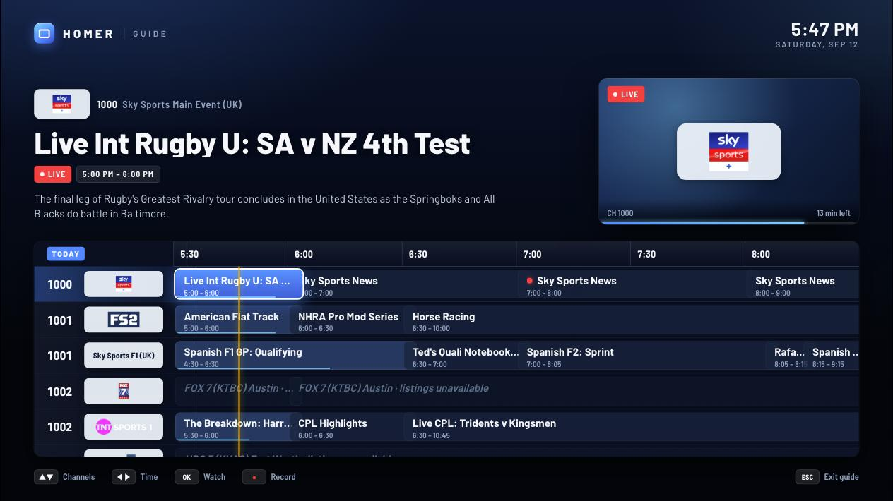

- Opens from a **Guide** button in Jellyfin's header, or the **G** key.
- **OK / Enter** (or a click) starts the channel in the same browser tab. On a
  program that hasn't started yet there's nothing to watch, so OK records it
  instead, like **R** (a click only selects it). The legend says what OK will
  do, and shows **R** only when it does something different.
- **◀ ▶** past the edge of the screen pages the guide later (or earlier, back
  to now), as far ahead as your listings go. The chip at the top left of the
  grid says which day you're looking at, and a new day's first slot is marked
  with its weekday. **N** jumps back to now.
- **R**, or the **●** button on a program you hover over, schedules a one-time
  recording of that program. Programs that are set to record get a red dot.
- On a program that's set to record, **R** (or its **■** button) cancels the
  recording, or stops it if it's already recording. The guide asks first:
  press **R** or click **■** again within a few seconds to confirm.
- Opens on top of whatever's playing, so the video keeps going: press **G** or
  the Guide button in the player's controls. Shrinking the player into the
  browser's floating window brings the guide up behind it.
- Over a full-screen video, the preview window shows the live picture of what
  you're watching.
- **Two sizes** (Settings → **Guide size**). **Standard** is five channels and
  three hours of listings at a time. **Large** is four channels and two hours,
  with the titles, channel names and numbers about 40% bigger — the same guide
  read from a couch instead of a desk. Changing it redraws the open guide where
  it stands, on the same channel and program; nothing reloads. HOMER's Apple TV
  app starts on Large, a browser on Standard, and a choice you make yourself
  always wins (it's kept per device). The Sports and News hubs' channel lists
  follow the same setting.
- **The filter chips are part of the arrows.** **▲** off the top channel moves
  up into the category and country row, **◀ ▶** run along it, **OK** picks and
  **▼** drops back onto the program you left. **[ ]**, **1–8** and **C** still
  do the same thing from the grid, so nothing changes if you have a keyboard.
- Scales a fixed 1920×1080 layout to fit any window, the way a TV UI does.
- Uses your existing Jellyfin sign-in. There's nothing to configure and no
  separate account or API key.

Standard and Large, both on a 1920×1080 stage:

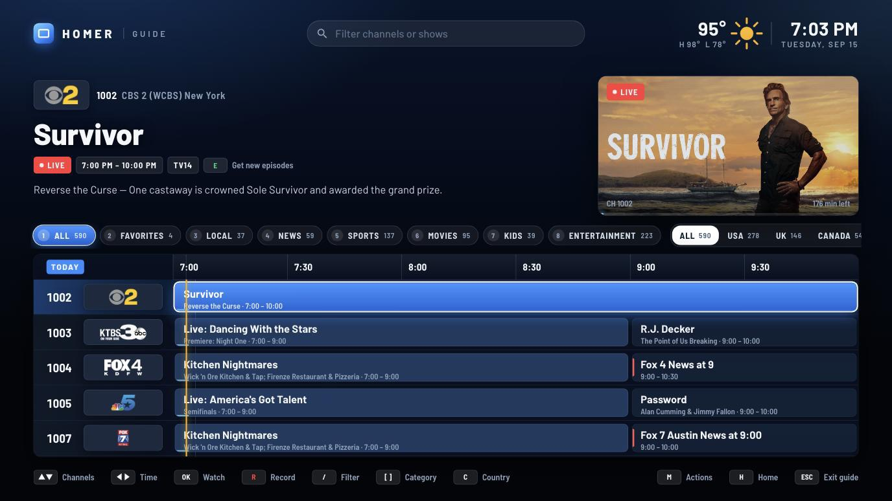

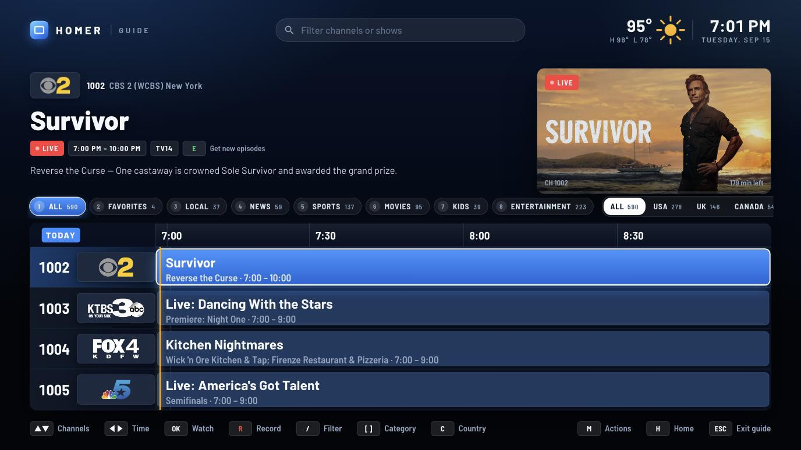

## Actions, for a remote with no letter keys

HOMER's shortcuts are letters, and an Apple TV's Siri Remote hasn't got any. So
every screen can put what it offers on screen: **hold OK** on the Siri Remote
for about half a second, or press **M** on a keyboard, and an **Actions** strip
comes up over the screen with the things that screen can do right now — each
with its name, its icon and its letter, so the strip teaches the shortcut
rather than replacing it. Arrows move, **OK** runs it, **Back/Esc** closes.

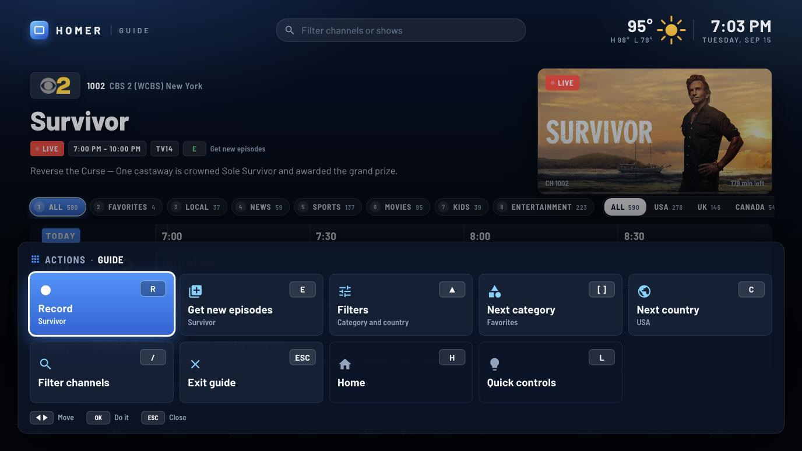

What's in it depends on where you are, and always ends with the three that work
anywhere: **Guide**, **Home** and **Quick controls**.

| Screen | Its own actions |
| --- | --- |
| **Guide** | Record / Cancel / Stop (**R**), Get new episodes (**E**), Back to now (**N**, while now is off screen), Filters (**▲**), Next category (**[ ]**), Next country (**C**), Filter channels (**/**), Exit guide |
| **Search** | What OK does on the highlighted result, Record (**R**), Get new episodes (**E**), Result group (**▲**), Search (**/**) |
| **Movies / TV Shows** | What OK does on the highlighted title, Filters (**▲**), Clear filters (**ESC**, while anything is on), Sort (**▲▲**), Search (**/**) |
| **Recordings** | What OK does on the highlighted recording, Next tab (**[ ]**), All recordings (**◀**, inside a show) |
| **Sports / News** | Next section (**]**), Previous section (**[**), Full screen (**F**, while the video is docked) |
| **Rooms** | Color (**C**) for the light you're on, Full screen (**F**) |
| **Home** | Search (**/**), Full screen (**F**) |
| **Now Playing** | Play/Pause, Stop, Mute and Remote for the card you're on, and Check again (**R**) |
| **Weather**, **Books** | Try again when something failed; Books adds Play/Pause (**P**) |
| **Music** | Play/Pause (**P**), Next track, Shuffle (**S**), Repeat (**R**), Instant Mix (**I**), Now playing |
| **Anywhere, with music loaded** | Play/Pause music, Next track, and **Music** to go back to it |
| **Anywhere, with Home Assistant connected** | **Who's home** — opens Rooms with the who's home band focused |
| **Anywhere, with an alert showing** | Dismiss alert (**Esc**), and **Weather** for a weather alert |
| **A recording playing full screen** | Skip 30s (**S**) |

A **swipe up** on the Siri Remote's clickpad runs the screen's one main action
without the strip: **Skip 30s** in the full-screen player, **Search** on the
Search screen, **Play/Pause** in Books, in Music and on the Now Playing card
you're on, and from anywhere else — Home included
— it opens the **Guide**. A **swipe down** closes the Actions strip, or the
quick controls panel if that's what's up; with nothing open it does nothing.

The Apple TV app sends these as DOM events on `window`, so anything else that
drives HOMER can too:

```js
window.dispatchEvent(new CustomEvent('homer-tv', { detail: { action: 'menu' } }));      // the strip
window.dispatchEvent(new CustomEvent('homer-tv', { detail: { action: 'swipe-up' } }));  // the main action
window.dispatchEvent(new CustomEvent('homer-tv', { detail: { action: 'swipe-down' } })); // close what's open
```

A screen registers what it offers with `shared/actions.js`
(`HomerActions.provide(...)`); its header comment is the contract.

## Settings

**Settings** (Home → Settings, `#/mypreferencesmenu`) replaces Jellyfin Web's
preference pages with a cable-box style screen. Audio language, Subtitles and
Subtitle language are saved to your Jellyfin account; **Streaming quality**,
**Guide size**, **Weather location**, **Live scores delay** and **Home
Assistant** are per device.

## On a phone

Jellyfin's Android and iOS apps (and a phone's browser) load HOMER too. When
the screen's shortest side is under 600px, HOMER switches to its phone layout,
in either orientation; a tablet keeps the TV layout, with touch (see
[Controls](#controls)).

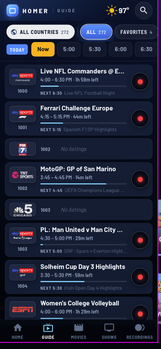

- A **top bar** (HOMER and the screen's name, the weather, **Search**) and a
  **tab bar** (Home, Guide, Movies, Shows, Recordings) on every HOMER screen.
  The weather opens the Weather screen. The phone shows the time, so HOMER
  doesn't.
- **The top bar has two buttons.** A tap on the **HOMER mark** opens the menu:
  a sheet with every screen there is, in the same order as the TV's menu, Home
  first and the one you're on ticked. The tab bar only has five, so this is how Now Playing, Music,
  Radio, Books, Sports, News, House and Settings are reached (Weather isn't
  on the list any more — the top bar's own weather bug opens it, on a phone
  same as on TV). Tap a row to
  go there; tap outside, swipe the sheet down, or press **Back** to put it
  away. (Back closes the sheet rather than leaving the screen.) Home is the
  first row, and the tab bar still has Home too.
- **A tap on the screen's name goes back to the top of that screen** — Music's
  browse page from an album or a track, Cameras' wall from one camera, the
  Movies or TV Shows grid from a show's page, Books' shelf from a book. The
  name is only drawn as a control (a ‹ beside it, the text lit) while there's
  somewhere above to go; at the top of a screen it's a plain label and a tap
  does nothing. Home is on the tab bar and at the top of the menu, so the name
  never has to double as a way there.

  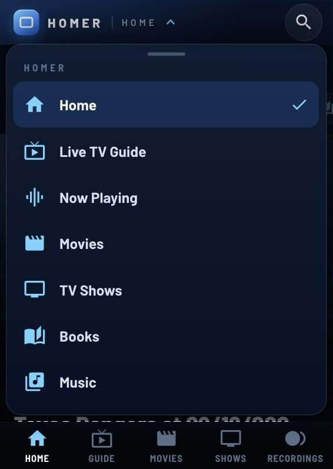
  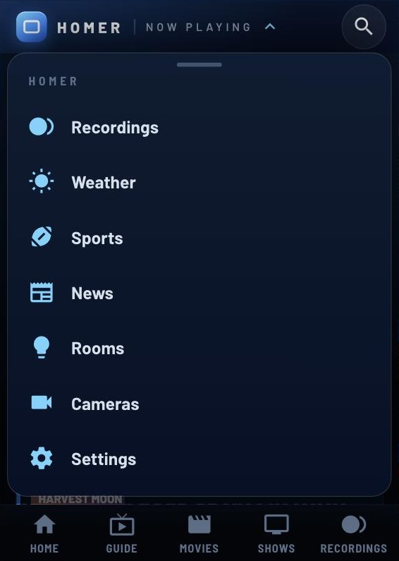
- **The guide** is a list: one row per channel with what's on (time left and a
  progress bar), what's next, and a **●** button. The time rail picks what the
  rows show: **Now**, or any half hour ahead. Category and country chips work
  as on TV (the country chip opens the choices). Channels with nothing listed
  get a slim row.
- **●** records the program in its row. On one that's set to record, the first
  tap says **Cancel?** (or **Stop?** while it's recording) and a second tap
  within a few seconds cancels it.
- **A tap on a row** opens a sheet with the program, **Record** and, for what's
  on now, **Watch**. Drag it down or tap outside it to put it away.
- **Watch** plays the channel in a strip under the top bar, and the list keeps
  scrolling under it (in landscape the video sits at the left). Tap the strip
  for full screen, **✕** to stop. **Back** goes back a screen, not out of the
  video.
- On a phone or tablet, live TV stops by itself once the screen has been
  locked, or HOMER has been in the background, for 3 minutes, so a phone in a
  pocket doesn't hold one of the provider's two streams. A recording or a
  movie just stays paused.
- **Cameras** is one column: the doorbell first, its **Recent** strip of rings
  and detections right under it (swipe it sideways, tap one to play the clip),
  then the other cameras and the placeholders. Tap a camera to open it — live
  view, its controls, its own Recent strip — and **‹ Cameras** to come back.

  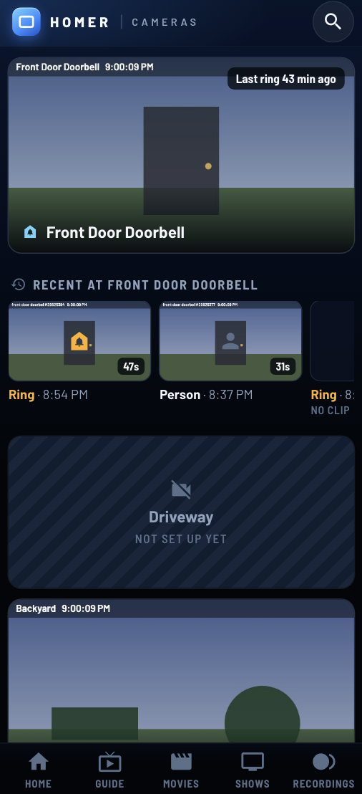

- **Planes** on a phone is the map on top and the list under it, one card an
  aircraft, nearest first, with the range chips (10-150 nm) between them. A tap
  on a card opens it out — speed, heading, climb, operator, aircraft — and a
  tap on the open one follows it, so the map recentres on it and keeps it
  there. **‹ Planes** in the top bar lets it go. In landscape the map takes the
  left half instead of the top.

  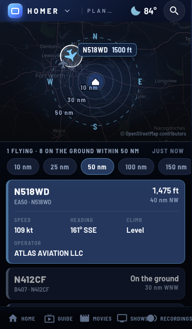

- **Movies and TV Shows** on a phone are a poster grid under the search field,
  the sort chips with the count, and the same filter chips as the TV — genre,
  decade, Unwatched, Favourites and 4K, each with its count — as a row you
  flick along. An amber **Clear** sits beside the row, outside it, so it's
  still there when the row has been flicked to its far end.

  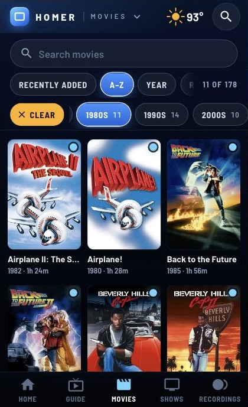

- Every HOMER screen has a phone layout of its own now — the guide, Home,
  Movies and TV Shows with their details pages, Search, Recordings, Settings,
  Rooms, Cameras and Planes (Live TV and House are one menu item apiece, over
  the guide/DVR and the rooms/cameras pair). See `docs/phone.md` for how one
  is built.
- **Music** on a phone: chips for Recently Added / Artists / Albums / Songs /
  **Favorites** / Playlists / Genres, the art two across, and a sheet for an
  album (its tracks) or an artist (their albums) with Play / Shuffle /
  **Play on…** / Mix. A **star** sits beside every track (its own 44px button,
  so a thumb on it doesn't start the track), on the album's header, and among
  Now playing's controls. A **mini player** sits above the tab bar whenever
  something is loaded — tap it for the full Now playing, with the cover, the
  controls, a volume slider and the lyrics. The mini player follows the music
  onto every other HOMER screen too.

  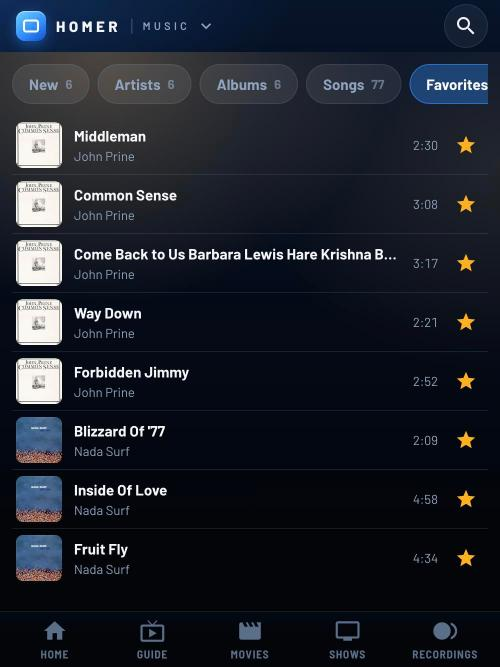

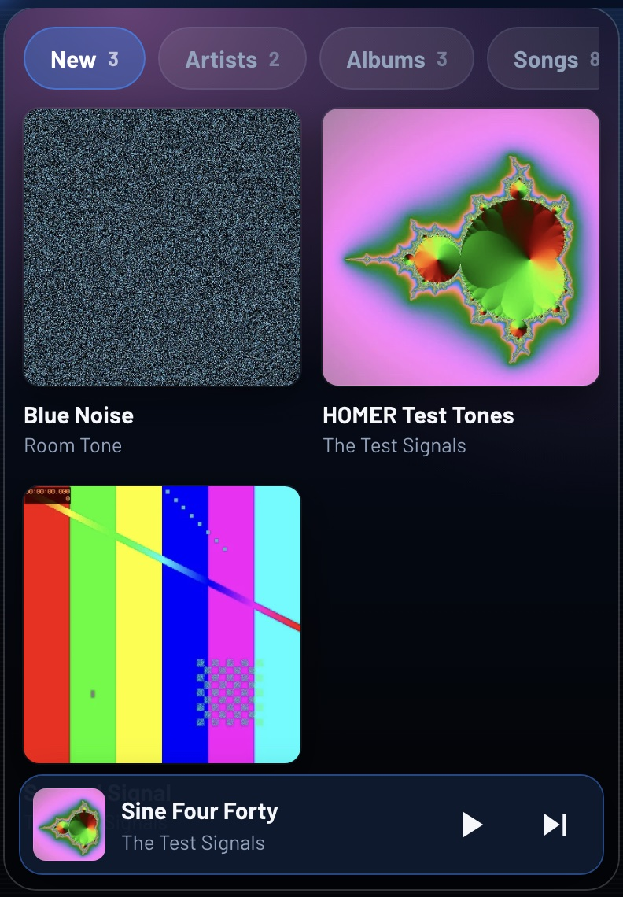

- **Now Playing** on a phone is the same cards in one column, biggest thing
  first, with the controls as buttons big enough for a thumb (− and + for the
  volume). There's no menu on it: the tab bar and the buttons on Home already
  have the screens.

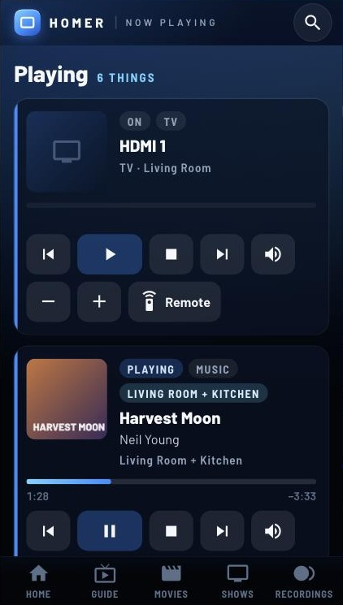
## While a screen opens

Jellyfin Web doesn't know HOMER's own addresses (`#/weather`, `#/rooms`,
`#/cameras`, `#/sports`, `#/news`, `#/books`, `#/music`, `#/playing`), so
opening one after a reload used to show Jellyfin's "Page not found" until
HOMER had loaded. HOMER now covers that with its own loading screen — the mark,
the screen you asked for, and a quiet pulse — from the moment the script runs
until the screen is drawn. On a phone it sits between HOMER's bars.


If nothing draws within fifteen seconds it says so rather than spinning, with
**Try again** and **Home** (arrows move between them, Back or Esc goes Home).

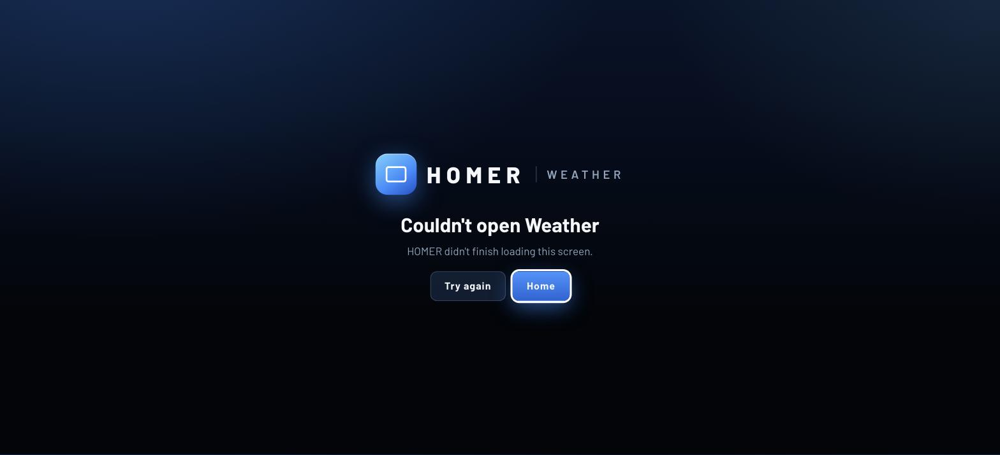

An address that isn't one of HOMER's is left alone, so Jellyfin's own
"Page not found" still answers for it.

## Install

The guide is a script, so it needs the
[JavaScript Injector](https://github.com/n00bcodr/Jellyfin-JavaScript-Injector)
plugin to load it into Jellyfin Web.

1. Install **JavaScript Injector**. It isn't in Jellyfin's default catalog, so
   first add its repository (Dashboard → Plugins → Catalog → ⚙️ → ➕) using the
   10.11 manifest URL from the
   [plugin's install instructions](https://github.com/n00bcodr/Jellyfin-JavaScript-Injector#%EF%B8%8F-installation).
   Then install it from the catalog and restart Jellyfin.
2. Open the plugin's settings (Dashboard → Plugins → JavaScript Injector), click
   **Add Script**, name it "HOMER", and paste this into the code box:

   ```js
   (function(){var s=document.createElement('script');s.src='https://cdn.jsdelivr.net/gh/endlessshrimp/jellyfin-channel-guide@v0.4.44/homer.js';document.head.appendChild(s);})();
   ```

3. Save, then reload Jellyfin in your browser. The Guide button appears in the
   header next to Search.

The URL is pinned to a release tag (`@v0.4.44`), so an update never changes
anything until you edit the tag yourself. jsDelivr and browsers both cache
aggressively, so after changing the tag, hard-refresh (Ctrl/Cmd+Shift+R).

## Controls

| Key | What it does |
| --- | --- |
| **G** | Open the guide (from anywhere in Jellyfin, unless you're typing in a text field) |
| **▲ ▼** | Change channel (keeps the same time slot, like a real guide) |
| **◀ ▶** | Move through time on the current channel. Past the edge of the screen, the guide pages later or earlier (never earlier than now) |
| **N** | Back to now, on what's airing on the current channel (the legend shows it once you've moved away from now) |
| **OK / Enter** | Watch the selected channel. On a program that hasn't started yet, record it (the same as **R**) |
| **R** | Record the selected program. On a program that's set to record, press **R** twice to cancel it (or stop it if it's recording) |
| **/** | Filter by channel name/number or show title (Esc clears) |
| **[ ] / 1–8** | Switch channel category: All, Favorites, Local, News, Sports, Movies, Kids, Entertainment |
| **C** | Switch country: All, USA, UK, Canada, France, Other (combines with the category) |
| **▲ from the top channel** | Move up into the guide's filter chips: **◀ ▶** along them, **OK** picks, **▼** back to the program you left. Search, Movies, TV Shows, Recordings and the Sports/News hubs reach their own chip and tab rows the same way |
| **Page Up / Page Down** | Jump a screen of channels |
| **H** | Go to Home (a playing channel keeps playing in Home's preview) |
| **M** | The **Actions** strip: what this screen can do right now, each with its own key (arrows move, OK runs, Esc closes). Holding OK on an Apple TV's Siri Remote does the same |
| **Play/Pause, Next, Previous** | The music (`#/music`), from any HOMER screen while something is loaded |
| **L** | Quick controls for Home Assistant's lights, scenes, players and thermostat, over whatever's playing (once Home Assistant is connected) |
| **Esc / Backspace / G** | Close the guide |

With a mouse or trackpad: scroll the grid freely (sideways moves through
time), hover to select, click a program to watch it (one that hasn't started yet
is only selected). A hovered program shows a **●** button at its right edge
that records it (**■** on a program that's set to record: click it twice to
cancel). Type in the filter box at the top to narrow the grid. The **N**,
**OK**, **/**, **[ ]**, **C**, **H** and **ESC** hints along the bottom are
clickable too.

On a touch screen (a tablet), the first tap on a program highlights it and
shows its **●** button; tap the button to record, or tap the highlighted
program again to watch it. Drag the grid with a finger to scroll the channels,
or sideways to move through time.

Scripts can also call `window.ChannelGuide.open()` and
`window.ChannelGuide.close()`.

## Compatibility

- **Jellyfin Web 10.11.x.** Tested against 10.11.8.
- **Works in** anything that runs Jellyfin Web: desktop and mobile browsers,
  Jellyfin Media Player, and the Jellyfin iOS/Android phone apps (with the
  phone layout).
- **Doesn't work in** native clients that don't use Jellyfin Web: Android TV /
  Fire TV, Roku, and Swiftfin (iOS / Apple TV). The JavaScript Injector plugin
  can't reach those apps.
- Recording needs a user with Live TV recording permission. Programs that
  your listings provider doesn't have data for show as "listings unavailable"
  and can't be recorded.

## Development

Serve the repo locally and load the script into a signed-in Jellyfin Web tab
from the browser console. The stylesheet loads from the same place as the
script, and loading the script again replaces the previous copy.

```sh
python3 -m http.server 8765
```

```js
const s = document.createElement('script');
s.src = 'http://<your-machine>:8765/guide/guide.js?t=' + Date.now();
document.head.appendChild(s);
```

Loaded on its own like this, the guide fetches its model
(`guide/guide-model.js`) and phone layout (`guide/guide-phone.js`) itself;
`homer.js` loads everything.

How a screen gets a phone layout, and how to test one without a phone:
[docs/phone.md](docs/phone.md).

`theme.css` is an older, separate stylesheet that restyles Jellyfin's built-in
guide page through Dashboard → General → Custom CSS. The guide doesn't need it.

## License

MIT. Channel Guide is an independent project, not affiliated with or endorsed by
any TV, cable or DVR company. "Set-top-box style" describes the look, not a
brand.

Weather icons in `shared/wx/` are [Meteocons](https://github.com/basmilius/meteocons)
by Bas Milius, MIT licensed (see `shared/wx/LICENSE`). Weather data comes from
[Open-Meteo](https://open-meteo.com/); the radar is the National Weather
Service's MRMS mosaic (from its map server, opengeo.ncep.noaa.gov, public
domain), and the radar's map is the Census Bureau's
([TIGERweb](https://tigerweb.geo.census.gov/), public domain).
