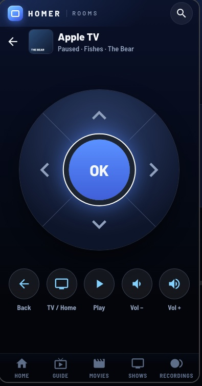
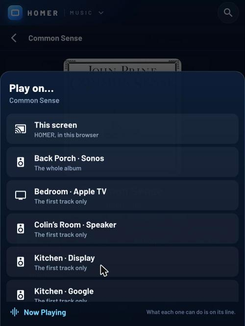
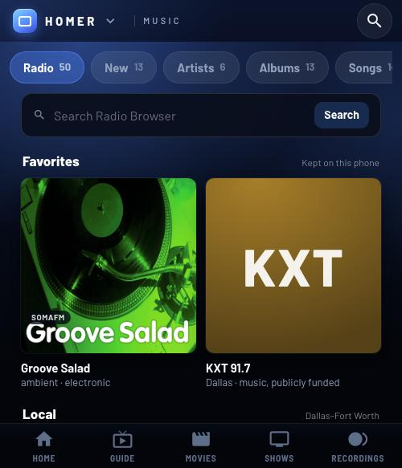
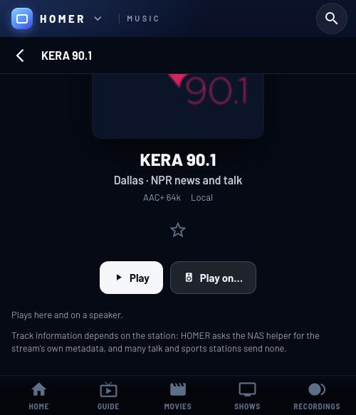
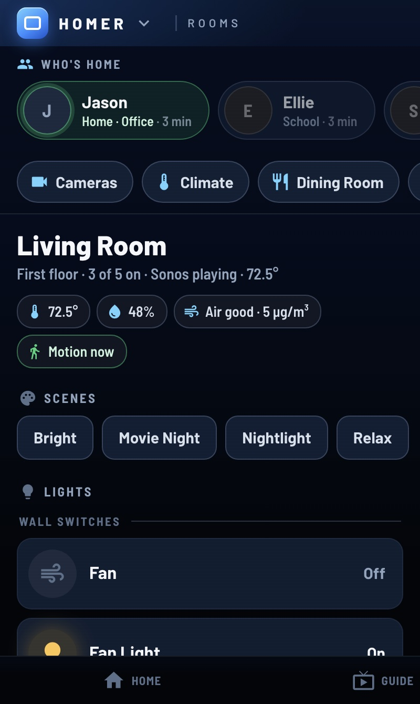

# HOMER on phones: how a screen gets a phone layout

HOMER runs on phones: Jellyfin's Android and iOS apps are wrappers around the
server's Jellyfin Web, so they load HOMER through the JavaScript Injector, and
so do mobile browsers. Every screen is reachable from the tab bar or from the
menu sheet the HOMER mark opens (below). Every HOMER screen has a phone layout of its own: the
guide, Home, Movies and TV Shows with their details pages, Search,
Recordings, Settings, Weather, Rooms, Cameras, Planes, Music (Radio is the
same screen, drawn on its own tab bar entry) and Now Playing.
A screen without one would draw its TV layout, shrunk to fit.

## Deciding the layout: `shared/layout.js`

`window.HomerLayout` decides with CSS media queries, never the browser's name:

- **Phone layout** when the window's shortest side is under 600px, in either
  orientation (`isPhone()`, `html.homer-phone`).
- **Touch** when the device can't hover, on either layout (`isTouch()`,
  `html.homer-touch`). A tablet keeps the TV layout, with touch.
- `onChange(fn)` fires when either flips (rotating, resizing) and when a
  screen's phone layout arrives. `force({ phone, touch })` overrides both, for
  testing.

On a phone, every HOMER screen gets the **phone chrome**: a top bar (HOMER and
the screen's name, the weather, Search) and a tab bar (Home, Guide, Movies,
Shows, Recordings), `html.homer-chrome` while they're up. Their heights are
`--homer-phone-top` and `--homer-phone-tabs` (safe-area insets included; see
`shared/phone.css`). Jellyfin's viewport tag already has `viewport-fit=cover`,
so `env(safe-area-inset-*)` works; `layout.js` adds it on phones if it's ever
missing.

## The menu on a phone: `HomerMenu.openSheet()`

The tab bar has five screens and HOMER has fourteen, so the rest were only
reachable from a row of buttons on Home — which you had to know was there. The
HOMER mark in the top bar opens the whole list instead (`shared/menu.js`,
styled in `shared/menu.css`): the same items in the same order as the TV's
rail, with **Home** added first, the one you're on ticked.

- `shared/layout.js` only wires the tap: `.hp-brand` calls
  `HomerMenu.toggleSheet()`, and falls back to `goHome()` if menu.js isn't
  loaded. Everything else is in menu.js, so there's one list, not two.
- **The sheet sits between the bars**, not over them: `#hm-sheet-root` is
  `top: var(--homer-phone-top); bottom: var(--homer-phone-tabs)`, so the top
  bar and the tab bar stay visible and unblocked. A tap outside — the bars
  included — dismisses the sheet and does nothing else, the way a sheet
  behaves anywhere else on a phone; tap again to use what's under it.
- **Back closes the sheet, not the screen.** Opening it pushes one history
  entry at the *same address* (`history.pushState(…, location.href)`, with
  whatever state was there kept, so `shared/player.js`'s own docked mark
  survives). No router sees an address change; the browser's Back takes that
  entry instead of the page, and `popstate` closes the sheet.
- **Take the entry away before navigating, never after.** `history.back()` is
  asynchronous, so closing the sheet and going somewhere in the same tick
  would pop the page you just went to. A row tap calls
  `closeSheet(then)`, which drops the entry and runs `then` once the
  `popstate` has come back (with a timeout in case it doesn't) — the same
  shape as `dropMark(then)` in `shared/player.js`. The result: one history
  entry per screen change, and Back from there lands where you started.
- A swipe down closes it, but only from the top of the list, so a scrolled
  list scrolls instead of dismissing.

## The top bar's other button: `HomerLayout.setScreenHome()`

The mark opens the menu; the **screen's name** beside it goes back to the top
of the screen you're on. Before that, a phone had no way out of an album, a
book or a camera except a keyboard's Esc — the name looked like part of the
Home button and did nothing of its own.

It's a contract, not a special case per screen. A screen registers what its
top is while it's mounted:

```js
const offHome = window.HomerLayout && window.HomerLayout.setScreenHome
    ? window.HomerLayout.setScreenHome(() => {
        if (!cam) return false;   // already at the top: not mine to handle
        closeCamera();
        return true;              // handled
    }, { atTop: () => !cam })     // optional: what draws (or hides) the ‹
    : () => {};
// …and offHome() in teardown()
```

The last screen to register wins, the way `HomerActions` picks its provider.
Returning `false` falls through to the defaults, which need no cooperation:

1. **The same route without its query.** `#/music?album=…`, `#/books?id=…`
   and `#/rooms?remote=…` are ways *in* to HOMER's own screens, so dropping
   the query is that screen's top. Jellyfin's own routes carry what they need
   in the query (`#/movies?topParentId=…`), so they're left alone.
2. **The grid a details page belongs to.** `#/details?id=…` has no top of its
   own; `whereAmI()` already knows whether it's a film or a show, so the name
   reads MOVIES or SHOWS and goes to that grid.
3. **A rebuild of the screen's module** (`close()` then `open()`), which opens
   it at its top. It costs a reload of that screen and it can't tell whether
   you're already there, so a registration is always better — this is only so
   a screen works before it has one.

### The same contract, driven from the TV layout

`setScreenHome()` isn't phone-only: a desktop mouse needs the same "back to
the top of this screen" affordance, and it reuses this exact registration —
no second mechanism. Two places call it:

- **The persistent menu** (`shared/menu.js`, on Home and Now Playing) wraps
  every item's `act()`: if the item's id matches the screen that's actually
  up (`currentId()`) and `canScreenHome()` says there's somewhere above,
  it calls `screenHome()` instead of navigating again. Otherwise the item
  behaves as it always did.
- **Each TV-layout screen's own top bar** splits its brand block in two: the
  mark and the HOMER wordmark still go Home (`goHome()`, unchanged); the
  screen's own name beside it (`.mu-brand-sub`, `.hc-brand-sub`, `.hl-brand-sub`,
  and so on) calls `canScreenHome()` / `screenHome()`, the desktop mirror of
  the phone's `.hp-here`. Before this, the whole brand block — mark, wordmark
  *and* name — went straight to `goHome()`, so clicking a screen's own name
  from inside an album, a details page or a camera left the screen entirely
  instead of climbing one level. Every screen with a registration needs this
  split; a screen that only relies on the defaults (Movies, TV Shows) still
  benefits since `canScreenHome()`/`screenHome()` already fall through to the
  details→grid and query-stripping defaults described above.

Two things worth copying:

- **The ‹ is on a timer, not an event.** Opening a sub-view inside a screen
  changes no route and adds nothing to `<body>`, so none of the chrome's
  usual triggers fire. `syncHere()` re-checks that one boolean twice a second
  while the bars are up and the tab is in front, and only touches the DOM when
  the answer changes.
- **The click is never `disabled`.** An attribute would go stale between those
  checks and swallow a legitimate tap; the handler asks `canScreenHome()`
  itself and returns if there's nowhere to go.

## A screen without a phone layout

Nothing to do. Its root is squeezed between the bars (`shared/phone.css`), and
its `fit()` scales the TV stage to that room with `HomerLayout.stageBox()`
(the window on a TV, so the TV layout doesn't change). The tab bar gets you
around meanwhile.

## Giving a screen a phone layout (the guide's pattern)

1. **Split the data and actions from the drawing.** The guide's channels,
   listings (3-hour chunks and their cache), timers, scheduling and cancelling
   (with its one-request-at-a-time and never-twice guards) and watching live in
   `guide/guide-model.js`. The TV layout (`guide/guide.js`) and the phone
   layout (`guide/guide-phone.js`) both draw from one model, and switching
   layouts keeps it, so nothing loads twice. (The library screens do the
   same with `library/library-model.js`; there, where each screen was, the
   title or the season, is in the model's `memory`, which both layouts read
   and write, so a switch lands in the same place.) A layout attaches to the model
   (`attach({ window, onChunk, onProbed })`) to say what time it shows and hear
   when listings arrive. A screen with little data can do less: Home's
   `loadData()` returns one promise (its rows and what's on), and both layouts
   are handed it. (Home has no position worth carrying from one layout to the
   other, so its phone layout has no `state()`.)
2. **Write the phone layout** in its own file, `x/x-phone.js`:
   `window.HomerXPhone = { create(ctx) }`, returning `{ phone: true, show(),
   state(), teardown() }`. `state()` is where it is (category, time, the
   channel at the top); the other layout starts from it. When the file has
   loaded it says so: `HomerLayout.register('x', { phone: true })`.
3. **Pick the layout when the screen opens:** `HomerLayout.usePhone('x')` (a
   phone, and the phone layout is loaded). Listen to `HomerLayout.onChange`;
   when `usePhone('x')` flips, tear down the one that's up and draw the other
   from its `state()`.
4. **Place it between the bars.** Its panels start at `var(--homer-phone-top)`
   and end at `var(--homer-phone-tabs)`. Keep its root id if other code looks
   for it (the phone guide is still `#cg-root`, with `.cg-phone`), and scope
   its CSS to a class so the TV stylesheet and the phone one can both be
   loaded.
5. **Navigation stays shared.** Route with `HomerPlayer.go(hash)`, `.back()`,
   `.goHome()`, and read where you are from `HomerPlayer.route()`, never
   `location.hash`: while a video is docked the address is the player's. On a
   phone the guide is a screen at its own route (`#/livetv?tab=1`) like the
   others, so the tab bar and the browser's Back treat it like one.
6. **Docked video:** give the layout a `[data-homer-preview]` element;
   HomerPlayer pins the real video over it (z-index 99995). A root that sits
   above that (the phone guide is at 99997, so its sheet can cover the tab bar)
   must leave the preview transparent once the video is in, so the video shows
   through. A phone root that keeps a TV root's id (the library's `#hl-root`)
   also gets the `homer-screen` class, so HomerPlayer finds its
   `[data-homer-preview]` rather than looking for the TV layout's preview. Tap it for full screen with `HomerPlayer.fullscreen()`, stop with
   `HomerPlayer.stop()`.
   - The player only looks for `[data-homer-preview]` inside `#cg-root` or a
     `.homer-screen` root (plus the TV screens' `.hm-preview`/`.hl-preview`),
     so a phone root with another id adds `homer-screen` to its classes (phone
     Home is `#hm-root.hm-phone.homer-screen`).
   - Outside the guide, the player takes any tap inside the preview as "full
     screen" (in the capture phase), so buttons drawn on the strip (✕, full
     screen) must be its siblings, layered over it, not its children.
   - Nothing between the root and the preview may paint a background: every
     ancestor of the hole up to the root has to be transparent, or the video
     is hidden. Put backgrounds on the panels beside the strip instead.
   - Put the strip where the guide's is (full width under the top bar in
     portrait; the left 42%, 16:9, in landscape), so the video doesn't move
     from one screen to the next.
7. **Touch rules:** 44px targets at least, nothing that only shows on hover, no
   long-press, and a press-again confirm (never a browser dialog) for anything
   that throws something away, like the guide's ● → "Cancel?".
8. **Look:** tokens from `shared/tokens.css`, Barlow, the navy backdrop, and
   channel logos on the dark chip through `HomerLogos.watch(img, chip)` (it
   knocks out a dark logo). The approved frames are the phone guide's list and
   its docked strip with the record sheet.

## Search's phone layout (`search/search-phone.js`)

- **No model file.** Search's data is one request per kind and a minute's
  cache, so `search/search.js` hands its search, cache, Back memory,
  navigation and formatting to the phone layout through `ctx`
  (`createPhone`). Both layouts write the same Back memory, so a change of
  layout (`remember()` on the one going away) starts the other at the same
  query, kind and result.
- **Recording** borrows the guide's model: `HomerGuideModel.create(server)`
  costs nothing until asked, and its `schedule`/`cancel` keep the
  one-request-at-a-time and never-twice guards.
- **The keyboard.** An iPhone only raises it for a focus inside a tap, and a
  screen opens a moment after the tap that routed to it. The top bar's Search
  calls `HomerSearch.phoneTap()` inside the tap: on Search it focuses the box;
  elsewhere a hidden stand-in `<input>` takes the focus (keyboard up) and the
  box takes it over, with anything typed, once it's showing. The keyboard
  covers the page without shrinking it (iPhones, Android's Chrome), so the
  list gets `--sp-kb` (from `visualViewport`) of room at its end; a finger
  moving on the list puts the keyboard away. The box is `type="search"`,
  `enterkeyhint="search"`, 17px (an iPhone zooms in on anything under 16px).
- **Docked video controls.** HomerPlayer turns a tap inside
  `[data-homer-preview]` into full screen (except in the guide), so buttons
  over the video (✕, full screen) are siblings of the preview element, not
  children. The root sits at 99997 like the phone guide's, above the video,
  with the strip left transparent once the video is in.
### Recordings, the same way

`recordings/recordings-phone.js` follows the guide, with a few differences
worth copying for a small screen:

- Its model, `recordings/recordings-model.js`, keeps no state: `load(server)`
  returns every tab's list (and a signature, so a quiet refresh that changed
  nothing redraws nothing), and `remove()` / `play()` do the rest. Each layout
  holds what it loaded. Where you are (the tab, an open folder) lives in a
  `memory` object that `recordings.js` hands both layouts, so a change of
  layout lands on the same tab.
- The root is still `#hr-root`, with `.homer-screen` (so the phone chrome and
  HomerPlayer see a HOMER screen) and `.hr-phone`. `.homer-screen` is what
  `shared/phone.css` squeezes between the bars, so the phone stylesheet puts
  it back to full height (`html.homer-chrome #hr-root.hr-phone`) and places
  its own panels between the bars, like the guide.
- A tap opens a sheet; anything that throws something away is a sheet button
  that arms on the first tap ("Tap again to delete") and ignores a second tap
  within 400ms (a double tap isn't a decision).
### Movies and TV Shows: rows that flick, and a button that doesn't

`library/library-phone.js` gets the same sort and filter chips as the TV
layout, and both build them from the same place —
`HomerLibraryModel.makeFilters(items, uhd)` works out which chips a library
can offer and what each one would leave, and `sortsFor`/`sortCompare` say how
it can be ordered. The layouts only differ in how they draw them:

- **Two scrolling rows, not two arrow-reachable ones.** The sorts and the
  filters each get a row with `overflow-x: auto`. The sort row stops short of
  the count and fades at its right edge (`mask-image`) so a chip half off the
  end isn't sliced through the middle; the filter row bleeds past the screen's
  padding with a negative margin, which is what makes it look like something
  to flick.
- **Clear sits outside the scroller.** A Clear chip inside the row would be
  off the left end exactly when you'd want it. It's a sibling of
  `.lp-filters` in `.lp-filterrow`, shown by dropping its `hidden`.
- **The row is built once and then only updated.** Rewriting its `innerHTML`
  on every change would throw `scrollLeft` back to 0 — tap a genre near the
  end of the row and the row would jump away under your thumb. `renderChips`
  writes the chips on the first pass and after that only sets counts and
  classes. When *what's on* changes it scrolls the lit chip into view, so the
  reason the grid is short isn't off the end of the screen.
- **44px targets.** The chips are the existing `.lp-chip` (36px of paint in a
  44px box), so the filters are the same thing to hit as the season and sort
  chips already were.

## Settings and Weather: a screen under the bars

The guide's phone layout sits above the bars (99997) and leaves its video
strip transparent. Settings (`settings/settings-phone.js`) and Weather
(`forecast/forecast-phone.js`) are simpler, and a good pattern for a screen
that's just a column:

- The root keeps the screen's id and `.homer-screen` (plus `.hx-phone` /
  `.hf-phone` to scope the CSS), so `shared/phone.css` puts it between the
  bars and HomerPlayer and the chrome count it as a screen. It stays at the
  screens' 99990, and scrolls inside itself.
- Docked video: a 16:9 `[data-homer-preview]` at the top (at the left in
  landscape), with what's playing, Full screen and ✕ in a bar under it. The
  real video (99995) covers the preview; the controls sit clear of it, so
  nothing needs to be see-through. A tap on the video is HomerPlayer's (full
  screen).
- The data stays in the TV file: Settings' `createModel(server)` (the
  settings, their values, saving with the new value shown at once), and
  Weather's `createFeed`, `summary`, `stripSlots`, `dayInfo`, the skies and
  `createRadar` (the map and loop for any panel size, names scaled with `t`).
  The TV file hands them to `create(ctx)`.
- A text box on a phone: `inputmode="numeric"` (and `pattern="[0-9]*"` for
  iPhones), 16px or larger so iPhones don't zoom, a real `<form>` so the
  keyboard's Done/Go submits, and `visualViewport` to keep the box above the
  keyboard (Settings' ZIP code).

## Rooms: Home Assistant on a phone

`rooms/rooms-phone.js` is a screen under the bars, like Settings, with a row
of room chips at the top (one room at a time) instead of a list you open.
Its data is `shared/homeassistant.js`, and its helpers (a room's summary, a
light's or thermostat's state, camera stills) come from `rooms/rooms.js`
through `ctx`, as Weather's do. **Who's home** sits above the chips — see
[Who's home](#whos-home) below. Two things worth copying:

- **Dimming with a finger**: the bar is a 26px-tall touch target around an
  8px track (`touch-action: none`), and the new brightness is sent once, when
  the finger lifts. A tap on the bar sets it there; a tap anywhere else on the
  row switches the light.
- **A bulb's colors** open as a sheet from the bottom, inside the screen's
  main area (above the tab bar): the presets in a grid of four, then a white
  strip and a color strip you drag (`touch-action: none`; the color is sent
  when the finger lifts or rests, like dimming). A tap beside the sheet, ✕ or
  Esc closes it. Everything else in a room stays one level deep: a player's
  buttons, inputs and a device's settings sit on its card, not behind it.
- **A TV's remote** (an Apple TV, a Samsung TV: `Remote` on the player's
  card) is a view over the room like a camera: a round pad (the arrows as
  wedges around OK, `clip-path`) and a row of Back, Home, Play/Pause, Vol−
  and Vol+, all 60px targets with `touch-action: none`. A press goes on
  `pointerdown`, not the tap, so it feels like a remote; it lights its button
  and buzzes (`navigator.vibrate(10)`, where the browser has it). A finger
  held on an arrow or the volume repeats after 450ms, then about six times a
  second, and the commands are dropped rather than queued when the device is
  slow (`HomerHA.sendRemote`). In landscape the keys move beside the pad.

  

- **The quick controls and the doorbell** (`rooms/quick.js`) are drawn once for
  both layouts: a sheet from the bottom and a card at the top on a phone
  (`.phone`), a panel at the right and a card at the top right, scaled from
  1080-tall units, on a TV.

## Cameras: one column, the doorbell first

`cameras/cameras-phone.js` is a screen under the bars like Settings and
Weather, with the same shape as its TV layout turned into a column. Worth
copying:

- **The data is a model file, not the TV screen.** `cameras/cameras-model.js`
  holds the wall (real cameras and the placeholders), each camera's controls,
  and its events — the camera's own clips from `media-source://reolink` and,
  where there are none, Home Assistant's history. `cameras/cameras.js` hands
  it to the phone layout through `ctx` (`model()`, plus its formatters:
  `whenText`, `agoText`, `runLength`, `roomTag`, `keepStill`,
  `statusMessage`). Both layouts share one model instance, so a change of
  layout doesn't re-read anything.
- **One level deep.** The column is the doorbell, its events strip, then the
  other cameras. A tap on any camera swaps the column for that camera's page
  (live view, controls, its own events) with a 44px **‹ Cameras** button; Esc
  and the phone's Back do the same. Nothing is nested further.
- **A strip of saved stills and clips as thumbnails.** An event's picture is
  the still Home Assistant saved of it if there is one, else its clip's first
  frame in a muted `<video preload="metadata">`. Either way two load at a
  time, so a strip of a dozen doesn't pull a dozen files off a battery camera
  at once; stills are queued first, because they come off the Pi's disk and
  ask the camera for nothing. A picture that never arrives leaves the event's
  icon showing, which is also what a history-only event ("No clip") gets.
  - A "No clip" event that *does* have a still isn't dimmed (`.cp-ev.pic`):
    there's a real picture of it, so it isn't a lesser row.
  - The stills are written by two Home Assistant automations into
    `/media/doorbell/<date>/<ring|person>-<stamp>.jpg` and read back through
    `media-source://media_source/local/doorbell` — see the header of
    `cameras/cameras-model.js`. Their URLs are signed and expire in about
    half a minute, so `M.stillUrl(ev)` resolves one per paint rather than
    holding it, exactly as `M.clipUrl(ev)` already does.
- **The camera's controls are 60px buttons**, two across (four in landscape),
  and each says what it will do rather than what it is (**Siren · Sound it**,
  **LED · Auto**). Nothing here needs a press-again confirm: none of them
  throws anything away.
## Music: a player that outlives the screen

`music/music-phone.js` is a sheet-based screen like Books', with one thing
worth copying for anything that plays:

- **The player isn't in the screen.** `music/music-model.js` owns the `<audio>`
  element and the queue on `document.body`, so tearing down either layout (or
  leaving `#/music` entirely) doesn't stop the music. `music/music-strip.js`
  draws the now-playing strip on every *other* screen; on a phone it sits above
  the tab bar (`.homer-chrome #mu-strip { bottom: calc(var(--homer-phone-tabs)
  + 8px) }`) and the screen's own `.mup-mini` takes over inside Music.
- **`pagehide` is not the page going away.** Jellyfin Web fires `pagehide` on
  its own in-app navigations, so a player that stops on `pagehide` (Books does,
  deliberately) stops every time you change screen. Music reports its position
  on `pagehide` and only stops on `beforeunload`.
- Both layouts read `HomerMusicModel.player.state()` and repaint from one
  `onChange`; the phone's mini player and the TV's strip are the same state
  drawn twice. A repaint arrives about four times a second, so anything the
  finger is on (the queue list) is only redrawn when the track actually
  changes.
- **A star that a thumb can hit.** The favorite star is a `<button>` of its own
  beside the row button, not an element inside it — a row that plays when
  tapped can't also hold a control that doesn't. The pair lives in a
  `.mup-song-row` / `.mup-track-row` flex wrapper, which is also where the
  hairline between rows moved to. The star's handler calls
  `stopPropagation()` and `preventDefault()` anyway, for the browsers that
  synthesise a click on the ancestor.
- **A star changing repaints stars, not lists.** `music-model.js` emits
  `'favorite'`; both layouts walk the stars already on screen and swap the
  glyph rather than rebuilding the list, because on a phone a thumb is usually
  still resting on one. Only the Favorites list itself is redrawn, since that
  is the one list a star actually changes.
- **One picker, two sizes.** "Play on…" (`music/playon.js`) is the same list on
  both layouts, with no layout-specific code in it: the screen passes `tv:
  true/false` and a host element, and `music/playon.css` switches between stage
  pixels (the TV's 1920x1080 stage, which the stage's own transform scales) and
  a real-pixel sheet from the bottom of a phone. The TV screen appends it
  *inside* `#mu-stage` so it scales with everything else; the phone appends it
  to `document.body`. The row is 84 stage pixels on the TV and a 60px thumb
  target on a phone.

  

  Two things that bit while building it: an icon sized with a class loses to
  the screen's own `#mu-root .material-icons { font-size: inherit }` (an id
  beats any class), so the size goes on the row's icon box and the glyph
  inherits it; and the picker's own `keydown` listener is registered later than
  the Music screen's, so capture-phase order alone won't keep the screen's keys
  out — `music.js` asks `HomerPlayOn.isOpen()` and stands aside.
- **Radio is a second kind of thing in the same screen.** The Radio tab
  (`music/radio-model.js`) adds stations, which are not Jellyfin items, to a
  screen built entirely around Jellyfin items. Three decisions made that cheap
  on both layouts:

  

  + **One player, not two.** A station is handed to
    `HomerMusicModel.player.play()` as an ordinary track with `live: true` and
    its own `streamUrl`. The player then skips the four things that only make
    sense for a Jellyfin track — building a `/Audio/{id}/universal` address,
    preloading a next track, fetching lyrics, and reporting to
    `/Sessions/Playing` — and everything else (the strip, the mini player, Now
    playing, the media keys, the volume) worked with no changes at all. Two
    `<audio>` elements would have meant touching every one of them.
  + **The sheet is two sheets.** `.mup-page` draws either an album
    (`drawPage`) or a station (`drawStation`), chosen by whether `stationItem`
    is set; `showPage` clears it and `showStation` clears `pageItem`. One
    sheet, one back stack, no second `push()` target.
  + **The picker takes a second kind of payload.** `HomerPlayOn.open()` grows
    an `opts.station` mode that swaps the device list (Music Assistant's
    players, from `HomerRadioModel.speakers()`) and the send function, and
    keeps all of the focus, key and CSS work. Radio needs none of the M3U
    machinery an album does, because `music_assistant.play_media` takes a
    stream address directly.

  

  The station sheet is also where the honest answer lives about what HOMER can
  and can't tell you: a browser cannot read ICY metadata off an `<audio>`
  element, so anything beyond SomaFM's published now-playing comes from the NAS
  helper, and plenty of stations send nothing at all. The sheet says which, per
  station, rather than leaving a blank line.
- **Typing inside a TV screen.** The Radio tab's search box is a real `<input>`
  inside `#mu-stage`, and the Music screen eats every letter key for its
  shortcuts. `music.js`'s `onKey` therefore checks for
  `.mu-radio-input` *first* and returns for anything but Enter (search), Escape
  (clear and give the keys back) and ▲▼ (blur and move); the existing
  `isTyping(ev.target) && !root.contains(ev.target)` guard doesn't help,
  because this input *is* inside the root.
## Now Playing: one model, two layouts, no menu on the phone

`playing/playing-phone.js` is the shortest version of the pattern, because
everything that isn't drawing already lives somewhere else:

- **The model is the whole screen.** `playing/playing-model.js` gathers the
  three sources (Jellyfin's `/Sessions`, Home Assistant's players, HOMER's own
  music), normalizes them into one list of cards and owns every control
  (`act(card, what, arg)`). Both layouts call `cards()`, `idle()` and
  `onChange()` and draw; neither knows which source a card came from.
- **`start()` and `stop()` belong to whichever layout is up.** The model polls
  `/Sessions` only while a layout has started it, so switching layouts hands
  the polling over rather than running it twice.
- **A progress bar doesn't need a poll.** A card carries `position` and `at`
  (when that position was read). Each layout runs its own cheap interval — 250
  ms on TV, 500 ms on the phone — and computes `position + (now − at)` for
  anything playing, so the bars move smoothly between samples.
- **The phone layout draws no menu of its own.** The TV layout puts
  `shared/menu.js` down the left so the screen doubles as a way into
  everything else; on a phone that job belongs to the chrome — the tab bar and
  the menu sheet the HOMER mark opens — so the phone layout is just the
  cards.

## The alert crawl on a phone: `shared/alerts.js`

The crawl isn't a screen and has no phone layout of its own: it's one strip,
`position: fixed`, drawn once and shown over whatever is up — a HOMER screen,
Jellyfin's own pages, or a video playing full screen. On a phone it only
changes shape.

- `shared/alerts.js` puts `.al-phone` on the strip while
  `HomerLayout.isPhone()`, and re-checks on every render, so a rotation or a
  layout change is picked up without the strip being rebuilt.
- `.al-phone` swaps the vh type for px, and sits on
  `bottom: var(--homer-phone-tabs)` — above the tab bar, never under it — with
  the safe-area insets on its left and right padding. Over full-screen video
  there is no tab bar, so `.al-phone.al-video` goes back to `bottom: 0`.
- Under 420px the crawl line is dropped and the headline and its detail stay:
  the words you need are "TORNADO WARNING" and where, not the NWS's four
  paragraphs, and a 375px phone can't crawl them fast enough to be read.
- Nothing on the strip is in the tab order or the screen's focus ring, so it
  changes nothing about how a phone screen scrolls or what a tap lands on.
  The ✕ is a 38px control inside a 44px-tall strip; the rest of the strip is
  a tap that opens Weather for a weather alert.

## Who's home

`rooms/rooms-phone.js` draws the same **who's home** band the TV Rooms screen
draws — `rooms/rooms.js`'s `peopleList()`, `peopleHtml()`, `peopleSig()`,
`paintFaces()` and `sinceText()`, handed over in `PHONE_CTX` — at the very
top of Rooms, above the room chips. A card a person: their picture or their
initials at 44px, their name, where they are and how long they've been there.
It scrolls sideways rather than wrapping, so it stays one line however many
people the house has, and it isn't drawn at all when there's nobody to show.
Nothing on it is a tap target: it says where everybody is and that's all it
does, on a phone as on a TV. (Until v0.4.18 this was a row in Home's top bar
beside the clock, where a TV remote could never reach it.)



## The shared TV shell: `shared/shell.css`

The TV screens' stage, palette, top bar (brand and clock), key legend, toast,
chips, buttons and loading state are in one file, listed per screen prefix
(`hl-` library, `hs-` search, `hr-` recordings, `hx-` settings, `hf-` weather,
`hn-` now playing, `ho-` rooms).
A new TV screen adds its prefix to those lists; its own stylesheet only holds
what it does differently. `shell.css` doesn't set `box-sizing`, so a screen
whose sizes are outer sizes says so itself (Now Playing does, once, for
`#hn-stage *`).

## Testing without a phone

- From a signed-in Jellyfin tab, add a same-origin iframe sized 390×844 (or
  844×390, 820×1180) at `/web/index.html#/livetv?tab=1`; the injector loads
  HOMER in it at that size. Load a local build into the iframe's document too.
- An iframe can't be a screen that can't hover: use `HomerLayout.force({ touch:
  true })` inside it.
- A hidden (automated) browser tab throttles timers to almost nothing and
  doesn't start video, so drive the iframe's timers yourself and fake the
  docked state (`HomerPlayer.docked`/`nowPlaying`) for screenshots.
- It won't decode **audio** either: an `<audio>` element sits at
  `readyState 0` / `networkState 2` for ever, even though the same URL fetches
  fine (and `AudioContext.decodeAudioData` on the bytes works). To shoot Now
  playing, wrap `HomerMusicModel.player.state` so it returns a position, and
  fire a `seeked` event on `#homer-music-audio` to make the screen repaint.
- To see a docked strip with a picture in it without playing anything, pin a
  stand-in: a `<video>` fed by a `canvas.captureStream()`, inside a
  `div.videoPlayerContainer.homer-pinned` at z-index 99995 over the preview's
  rect. The layouts' "the video is in" checks see it as the real thing.
- Never play live TV from an automated tab: the provider allows two streams.
- For the **alert crawl**, `HomerLayout.force({ phone: true })` is enough to
  see `.al-phone` — it reads the layout, not the viewport. Feed it a real NWS
  alert with `HomerAlerts._fetch(...)` (see the README's Alerts section) and
  `HomerAlerts._live()` to put it back.

## A worked example: Planes

`planes/planes.js` is the shortest version of the whole contract, because both
of its layouts read one model and draw one map:

- `planes/planes-model.js` holds the data, the polling and the "where is the
  house" question. It has no DOM in it at all, and `create()` hands back the
  *same* instance every time, so the TV layout and the phone layout share one
  poll of the ADS-B feed rather than each running their own.
- `planes/planes-map.js` is the map: tiles, range rings, the house, the
  aircraft, the followed one's track. It takes a host element and a `draw()`
  call, so the two layouts differ only in the box they put it in — the TV puts
  it beside the list, the phone puts it above.
- `planes/planes.js` decides which to draw (`HomerLayout.usePhone('planes')`),
  hands the phone layout its helpers through `PHONE_CTX`, and carries the
  focused and followed aircraft across when the layout flips mid-session
  (`state()` on the way out, `ctx.was` on the way in).
- `planes/planes-phone.js` registers itself with
  `HomerLayout.register('planes', { phone: true })` at the bottom of the file,
  which is what tells `usePhone` the layout exists.
- Its `setScreenHome` says the top of the screen is "nothing followed, no card
  open", so the ‹ beside **Planes** in the top bar lets a followed aircraft go
  instead of leaving the screen — and disappears when there's nothing to let
  go of.

Its phone CSS is scoped to `.vp-phone` so `planes.css` and `planes-phone.css`
can both be loaded at once; the map's own `.pm-` rules live in `planes.css`
and are shared, with a handful of smaller type sizes under `.vp-phone`.
